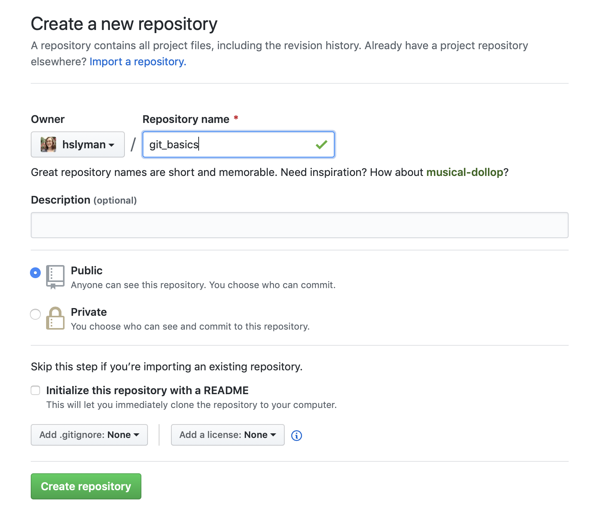
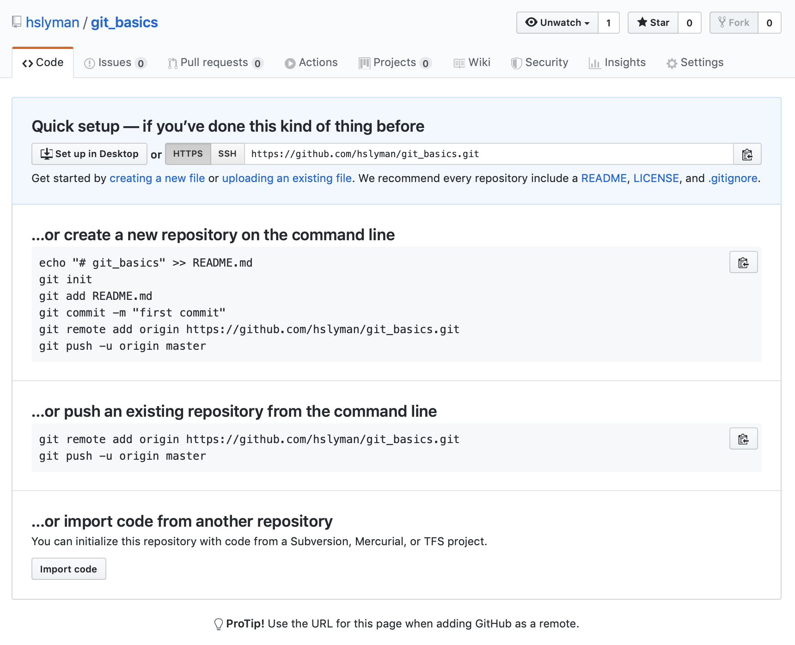
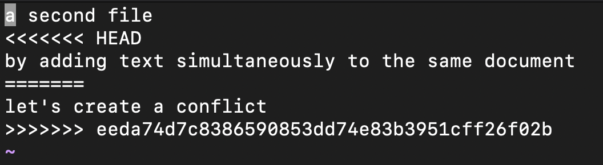
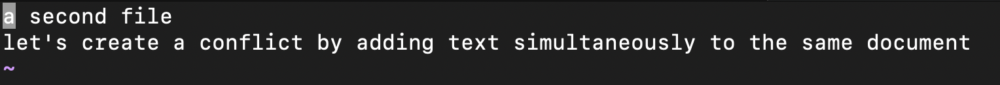

What is Git?
============

Git is an open source version control system. It allows users to keep track of changes made to code stored in local or remote repositories (repos). Every repo is a directory with a history that documents all the changes made in each version of the tracked files it contains. Tracking changes with Git happens in three steps:

1. The user makes changes to files in the repo
2. Changes are staged, adding them to the next commit
3. Staged changes are committed to the repo's history

The history of a repository forms a tree. Each commit in the tree describes exactly what was added to and subtracted from the repo since the previous commit. All the information needed to go from the very first version to the most recent, or any version in between, is contained in the commit history. This tree can be very simple, like a straight line, or something more branched, depending on the complexity of the project. Even if your project is small, version control may still be helpful for record-keeping and collaboration.

Git is already installed on tadpole. These exercises assume you are logged into tadpole and working within directory where you have write permissions. If you have Git installed on your personal computer, you should be able to do the exercises there, too.

In addition to Git itself, you will need a GitHub account. If you don't have one yet, [set one up now](https://github.com).

Getting started
===============

When you set up Git for the first time, you will want to set your username and email address. These allows Git to identify who authored each change to a project. If you are already using Git on your computer, you may already have done this. Let's check.

	git config --list

If you haven't set your username, or you want to reset your username, you can configure it from the command line.

	git config --global user.name "<username>"

Make sure your email address matches the one used by your GitHub account.

	git config --global user.email "<email>"

Using `--global` sets the username and password for all repos, so you won't have to do this again for each one. However, if you are using Git in more than one location (for example, on your personal computer and also on the cluster), you will need to do it each time you set up Git.

Setting up a local repository
=============================

It's very simple to set up a local repo. It can be done with a one-line command, and it doesn't matter if the directory is empty or contains code already. It's easiest to do this from inside the directory that you want to make into a repo.

	mkdir git_basics
	cd git_basics
	git init
	ls -a

You should see that your `git_basics/` directory now contains a .git directory. This means `git_basics/` is now a repo.

Making and tracking changes
===========================

Before we do anything else, let's take a look at what is going on in this repo.

	git log

The `git log` command lists the version history of the current branch. In this case, our tree only has one branch, called "master." This is the default branch that is created when the repo is initialized. No commits have been made in this repo, so it has no history.

	git status

The `git status` command displays the state of the working directory and tells us whether or not any changes made have been staged for the next commit. This repo is empty, so there is nothing to look at yet.

It's a good idea to start a repo out with a README that describes the project.

	echo "#Git Basics" > README.md
	echo "An introduction to a few basic commands for using Git." >> README.md

The repo is no longer empty. What do its history and status look like now?

	git log

The repo still has no history, even though the contents have changed. This is because the history contains only changes that have been committed.

	git status

This tells us that changes have been made, but not staged. It also tells us what we have to do to make sure our changes are included in the next commit. Don't forget to use tab complete!

	git add README.md
	git status

Now that our changes have been added, we are ready to commit them to the repo's history. Each commit has a commit message, an informative note about the changes that were made. This commit is the first one in the repo, and there is not much to comment on, so I'm going to use "initial commit." If you do not provide one using the `-m` option, you will be prompted to do so in the vi text editor.

	git commit -m "initial commit"

Let's make more changes to the repo.

	echo "17 December 2019" >> README.md
	echo "a second file" > test.txt
	git status

The result this time is a little bit different than last time. Now we have two different messages, which tell us that there are changes "not staged for commit" in the README, as well as untracked files. If you don't remember what changes you made, you can find out how the files have changed since your last commit before adding those changes to the staging area. The default behavior of the `git diff` is to print unstaged changes.

	git diff

Only changes to the README, which also exists in the previous commit, are displayed. If you are satisfied with these changes, add them to the staging area. We can add the new file at the same time.

	git add README.md test.txt

After staging these changes, we will get different output from `git diff` and `git status`.

	git diff --staged
	git status

To examine staged changes in detail, use the `--staged` option.

	git diff --staged
	git commit -m "updated README and added a second file"

Sometimes a repository may contain a file that does not actually need to be tracked. For example, a very large data file to which no changes are being made (e.g. a genome sequence), or a log file that records the output of scripts for debugging purposes.

	echo "read-only data" > data.txt
	echo "output data for debugging purposes" > log.txt

To avoid tracking the file, simply don't add it to any commit. But let's say you add something...

	git add log.txt
	git status
	git commit -m "now tracking log.txt"

... and then change your mind.  You can tell Git to stop tracking it without deleting the file.

	git rm --cached log.txt
	git status
	git commit -m "no longer tracking log.txt"

But be careful. Without the `--cached` option, the `git rm` command deletes the file from the directory entirely.

	git rm log.txt # This deletes the file!

Let's look at the history of the repo now.

	git log

The most recent commit appears first, and each commit is followed by an identifying alphanumeric string (SHA-256 hash). In addition to examining staged and unstaged changes, we can use `git diff` to compare the state of the repo at any two commits.

	git diff <commit> <commit>

**Extra credit:** What is the difference between these two commands?

	git diff <commit> <commit>
	git diff <commit> # Hint: Try your first commit's SHA hash

Remote repositories
===================

Local repos, like the one we've been working with until now, exist only on the computer where they were created. So how do we actually use what we've learned to work on a project from more than one computer, allow a collaborator to join that project, or share our code? For that we'll need a _remote_ repo.

Working with a remote repo often starts with one of these scenarios:
* You have an existing local repo and you want to make it available as a remote repo.
* You have an existing remote repo and you want to work on it from your local environment.

We already have a local repo, so let's start here. In order to make a repo available online, we need somewhere to host it. For this workshop we'll use GitHub as our host.

To start, go to GitHub, log in, and click on the "New" button. Make a public repo called "git\_basics."

Your screen should look like this:

After you click the "Create repository" button, you should see another screen with helpful instructions.

We are going to follow the instructions to push an existing repository from the command line. Copy the URL and switch back to the command line.

	git remote add origin <url>
	git push origin master

By executing these commands, we are telling the local repo how to communicate with the remote repo (using the URL), and pushing the history (all of the commits you've made up to this point) from the local repo's master branch to the remote repo. It's convention to call this remote "origin." From now on, we will treat the remote repo as our primary code base, and the local repo as the working copy.

We created a local repo, created a remote repo, and then uploaded our local repo. This same process can be done in reverse, starting with a remote repo instead. See the first set of instructions in the quick setup image above.

Cloning a remote repository
===========================

But what if you want to work with an existing codebase? You need a local copy of the remote repo. This is called "cloning." To do it, just copy the URL of the remote repository, then use `git clone`.

We can even clone the remote repo we just created.

	cd ..
	git clone <url> cloned
	cd cloned
	ls

You now have a directory, `cloned/`, with the contents, history, and config of the remote `git_basics` repo. Even though the directory is called "cloned," the local repository in it still points to the `git_basics` remote repo.

Pushing and pulling
===================

The local repo is the working copy. How do you update the remote repo with changes made locally? You push commits.

	echo "more changes" >> test.txt
	git status
	git add test.txt
	git commit -m "first commit after adding remote"
	git push # Refresh the GitHub page to see your changes reflected in the remote repo

What if someone else is also pushing to the remote repo? How do you get the changes they made? To get changes from the remote, pull.

	cd ../git_basics # this local repo doesn't have the commit you just pushed
	git pull # now it does

Pulling does two things. First, it downloads history from the remote, and second, it integrates those changes into your local code. You may see people using `git fetch` followed by `git merge` instead. This is equivalent to `git pull`. If there are merge conflicts, you will be asked to resolve them.

Resolving conflicts
===================

If the remote remote's history contains any commits that are not in the local repo's history, you will have to pull, and possibly resolve merge conflicts, before you can push.

To practice resolving conflicts, you need to create some conflicts first.

	# In git_basics/
	echo "let's create a conflict" >> test.txt
	git status
	git add test.txt
	git commit -m "first conflicting commit"
	git push

Now, in your other local copy of this repo, make different changes.

	cd ../cloned
	echo "by adding text simultaneously to the same document" >> test.txt
	git add test.txt
	git commit -m "second conflicting commit"
	git push

What happened? Why wasn't your push successful?

	git pull

When you pull, you should see something like this:

	Auto-merging test.txt
	CONFLICT (content): Merge conflict in test.txt
	Automatic merge failed; fix conflicts and then commit the result.

All right, so let's `nano test.txt` and fix those conflicts. You should see a bunch of weird things in your file when you open it:

Every conflict in a file will be marked this way. To resolve it, replace the marked block with the merged code.

Commit the merged file.

	git status
	git add test.txt
	git commit -m "resolved merge conflict"
	git push

Let's make sure `git_basics/` (the local repo) is up to date.

	cd ../git_basics
	git pull

It is best practice to pull and merge any resulting conflicts that may have arisen before you push your commits.

Branching
=========

Branching can be useful to allow users to continue development on one or more parts of a project while leaving a working version of the code available.  At its heart, branching is a project management tool provided by Git to help teams work on multiple moving parts of complex projects simultaneously.

As you can imagine, each team manages their projects differently, and a team that elects to use branching might be just as productive as a team that does not. The material we've covered today is often enough for many teams in many fields.

Undoing changes
===============

One of the reasons to have version control is to be able to reverse changes. Git provides many ways to do this. Although it is possible, it is generally best to **avoid rewriting a repo's history**. Changing history can cause serious problems, particularly if there is more than one contributor working on a project.

Fortunately, there are plenty of ways to correct a mistake without rewriting history.

Command | Effect
--------|--------
git reset \<file\> | un-stage changes without discarding them
git stash | temporarily undo changes to all tracked files
git stash list | view stashed change sets
git stash pop | restore most recently stashed changes
git stash drop | discard most recently stashed changes
git checkout \<file\> | discard uncommitted changes to file
git revert \<commit\> | create a commit that reverses the effects of the specified commit
git revert \<commit 1\>..\<commit 2\> | create a commit that reverses the effects of a series of commits

All of these commands have multiple options that may change their effects, sometimes dramatically.

I encourage you to experiment with these commands and consult the man pages for more information.
