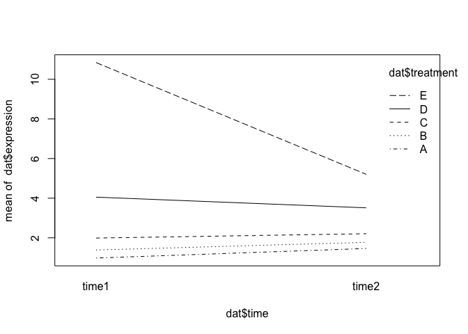
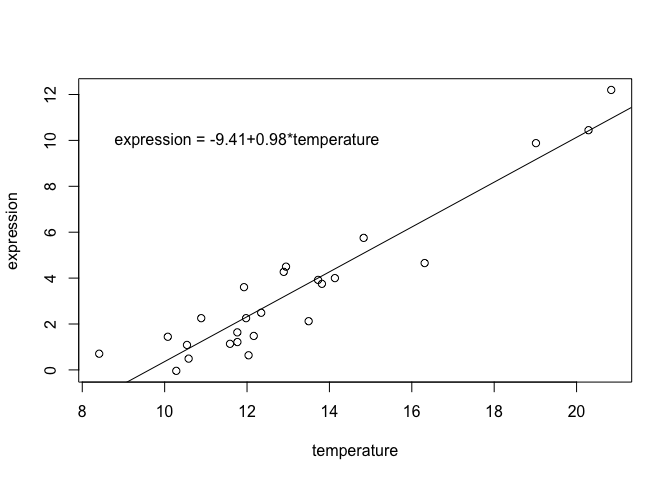

# Linear Models in R


Many bioinformatics applications involving repeatedly fitting linear models to data.  Examples include:

* RNA-Seq differential expression analyses
* GWAS (for continuous traits)
* eQTL analyses
* Microarray data analyses
* and on and on ....

Understanding linear modelling in R is **critical** in implementing these types of analyses.

## Scope
* Basics of linear models
* R model syntax
* Understanding contrasts
* Models with continuous covariates

We will not discuss:

* Diagnostic plots 
* Data-driven model selection
* Anything that doesn't scale well when applied to 1000's of genes/SNPs/proteins

# Linear models

A linear model is a model for a continuous outcome Y of the form
$$Y = \beta_0 + \beta_{1}X_{1} + \beta_{2}X_{2} + \dots + \beta_{p}X_{p} + \epsilon$$
The covariates X can be:

* a continuous variable (age, weight, temperature, etc.)
* Dummy variables coding a categorical covariate (more later)

The $\beta$'s are unknown parameters to be estimated, the "coefficients".

The error term $\epsilon$ is assumed to be normally distributed with a variance that is constant across the range of the data, the "residuals".

Models with all categorical covariates are referred to as ANOVA models and models with continuous covariates are referred to as linear regression models. These are all linear models, and R doesn't distinguish between them.

Read in 'lm_example_data.csv`:

```r
dat <- read.csv("https://raw.githubusercontent.com/ucdavis-bioinformatics-training/2019-Winter-Bioinformatics_Command_Line_and_R_Prerequisites_Workshop/master/Advanced_R/lm_example_data.csv")
dim(dat)
```

```
## [1] 25  6
```

```r
head(dat)
```

```
##   sample expression  batch treatment  time temperature
## 1      1  1.2139625 Batch1         A time1    11.76575
## 2      2  1.4796581 Batch1         A time2    12.16330
## 3      3  1.0878287 Batch1         A time1    10.54195
## 4      4  1.4438585 Batch1         A time2    10.07642
## 5      5  0.6371621 Batch1         A time1    12.03721
## 6      6  2.1226740 Batch1         B time2    13.49573
```

```r
tail(dat)
```

```
##    sample expression  batch treatment  time temperature
## 20     20   4.270954 Batch2         D time2    12.89125
## 21     21  12.197843 Batch2         E time1    20.84079
## 22     22   5.752513 Batch2         E time2    14.83138
## 23     23   9.881167 Batch2         E time1    19.01435
## 24     24   4.655431 Batch2         E time2    16.31208
## 25     25  10.445337 Batch2         E time1    20.29026
```

```r
str(dat)
```

```
## 'data.frame':	25 obs. of  6 variables:
##  $ sample     : int  1 2 3 4 5 6 7 8 9 10 ...
##  $ expression : num  1.214 1.48 1.088 1.444 0.637 ...
##  $ batch      : Factor w/ 2 levels "Batch1","Batch2": 1 1 1 1 1 1 1 1 1 1 ...
##  $ treatment  : Factor w/ 5 levels "A","B","C","D",..: 1 1 1 1 1 2 2 2 2 2 ...
##  $ time       : Factor w/ 2 levels "time1","time2": 1 2 1 2 1 2 1 2 1 2 ...
##  $ temperature: num  11.8 12.2 10.5 10.1 12 ...
```

## Linear models in R

R uses the function `lm` to fit linear models.

`lm` minimally requires a model formula.

### Formulas (from the help docs)

The ~ operator is basic in the formation of such models. An expression of the form y ~ model is interpreted as a specification that the response y is modelled by a linear predictor specified symbolically by model.

Models consists of a series of terms separated by + operators. The terms themselves consist of variable and factor names separated by : operators. Such a term (:) is interpreted as the interaction of all the variables and factors appearing in the term.

There are a number of other operators that are useful in model formulae, read the help documentation if you need more advanced modeling fomula.

A model with no intercept can be specified as y ~ x + 0 or y ~ 0 + x.

For our data, lets fit a linear model using `expression` as the outcome and `treatment` as a categorical covariate:

```r
oneway.model <- lm(expression ~ treatment, data = dat)
```

In R model syntax, the outcome is on the left side, with covariates (separated by `+`) following the `~`.


```r
oneway.model
```

```
## 
## Call:
## lm(formula = expression ~ treatment, data = dat)
## 
## Coefficients:
## (Intercept)   treatmentB   treatmentC   treatmentD   treatmentE  
##      1.1725       0.4455       0.9028       2.5537       7.4140
```

```r
class(oneway.model)
```

```
## [1] "lm"
```

Note that this is a "one-way ANOVA" model.

`summary()` applied to an `lm` object will give p-values and other relevant information:

```r
summary(oneway.model)
```

```
## 
## Call:
## lm(formula = expression ~ treatment, data = dat)
## 
## Residuals:
##     Min      1Q  Median      3Q     Max 
## -3.9310 -0.5353  0.1790  0.7725  3.6114 
## 
## Coefficients:
##             Estimate Std. Error t value Pr(>|t|)    
## (Intercept)   1.1725     0.7783   1.506    0.148    
## treatmentB    0.4455     1.1007   0.405    0.690    
## treatmentC    0.9028     1.1007   0.820    0.422    
## treatmentD    2.5537     1.1007   2.320    0.031 *  
## treatmentE    7.4140     1.1007   6.735 1.49e-06 ***
## ---
## Signif. codes:  0 '***' 0.001 '**' 0.01 '*' 0.05 '.' 0.1 ' ' 1
## 
## Residual standard error: 1.74 on 20 degrees of freedom
## Multiple R-squared:  0.7528,	Adjusted R-squared:  0.7033 
## F-statistic: 15.22 on 4 and 20 DF,  p-value: 7.275e-06
```
In the output:

* "Coefficients" refer to the $\beta$'s
* "Estimate" is the estimate of each coefficient
* "Std. Error" is the standard error of the estimate
* "t value" is the coefficient divided by its standard error
* "Pr(>|t|)" is the p-value for the coefficient
* The residual standard error is the estimate of the variance of $\epsilon$
* Degrees of freedom is the sample size minus # of coefficients estimated
* R-squared is (roughly) the proportion of variance in the outcome explained by the model
* The F-statistic compares the fit of the model _as a whole_ to the null model (with no covariates)

`coef()` gives you model coefficients:

```r
coef(oneway.model)
```

```
## (Intercept)  treatmentB  treatmentC  treatmentD  treatmentE 
##   1.1724940   0.4455249   0.9027755   2.5536669   7.4139642
```
What do the model coefficients mean?

By default, R uses reference group coding or "treatment contrasts". For categorical covariates, the first factor level (alphabetically by default) is treated as the reference group.  The reference group doesn't get its own coefficient, it is represented by the intercept.  Coefficients for other groups are the difference from the reference:


```r
levels(dat$treatment)
```

```
## [1] "A" "B" "C" "D" "E"
```

For our simple design:

* `(Intercept)` is the mean of expression for treatment  = A
* `treatmentB` is the mean of expression for treatment = B minus the mean for treatment = A
* `treatmentC` is the mean of expression for treatment = C minus the mean for treatment = A
* etc.

```r
# Get means in each treatment
treatmentmeans <- tapply(dat$expression, dat$treatment, mean)
treatmentmeans["A"] 
```

```
##        A 
## 1.172494
```

```r
# Difference in means gives you the "treatmentB" coefficient from oneway.model
treatmentmeans["B"] - treatmentmeans["A"] 
```

```
##         B 
## 0.4455249
```

What if you don't want reference group coding?  Another option is to fit a model without an intercept:

```r
no.intercept.model <- lm(expression ~ 0 + treatment, data = dat) # '0' means 'no intercept' here
summary(no.intercept.model)
```

```
## 
## Call:
## lm(formula = expression ~ 0 + treatment, data = dat)
## 
## Residuals:
##     Min      1Q  Median      3Q     Max 
## -3.9310 -0.5353  0.1790  0.7725  3.6114 
## 
## Coefficients:
##            Estimate Std. Error t value Pr(>|t|)    
## treatmentA   1.1725     0.7783   1.506 0.147594    
## treatmentB   1.6180     0.7783   2.079 0.050717 .  
## treatmentC   2.0753     0.7783   2.666 0.014831 *  
## treatmentD   3.7262     0.7783   4.787 0.000112 ***
## treatmentE   8.5865     0.7783  11.032 5.92e-10 ***
## ---
## Signif. codes:  0 '***' 0.001 '**' 0.01 '*' 0.05 '.' 0.1 ' ' 1
## 
## Residual standard error: 1.74 on 20 degrees of freedom
## Multiple R-squared:  0.8878,	Adjusted R-squared:  0.8598 
## F-statistic: 31.66 on 5 and 20 DF,  p-value: 7.605e-09
```

```r
coef(no.intercept.model)
```

```
## treatmentA treatmentB treatmentC treatmentD treatmentE 
##   1.172494   1.618019   2.075270   3.726161   8.586458
```
Without the intercept, the coefficients here estimate the mean in each level of treatment:

```r
treatmentmeans
```

```
##        A        B        C        D        E 
## 1.172494 1.618019 2.075270 3.726161 8.586458
```
The no-intercept model is the SAME model as the reference group coded model, in the sense that it gives the same estimate for any comparison between groups:

Treatment B - treatment A, reference group coded model:

```r
coefs <- coef(oneway.model)
coefs["treatmentB"]
```

```
## treatmentB 
##  0.4455249
```
Treatment B - treatment A, no-intercept model:

```r
coefs <- coef(no.intercept.model)
coefs["treatmentB"] - coefs["treatmentA"]
```

```
## treatmentB 
##  0.4455249
```

## testing contrasts using emmeans


```r
if (!("emmeans" %in% rownames(installed.packages())))
  install.packages("emmeans")
library(emmeans)
```

```
## Welcome to emmeans.
## NOTE -- Important change from versions <= 1.41:
##     Indicator predictors are now treated as 2-level factors by default.
##     To revert to old behavior, use emm_options(cov.keep = character(0))
```

```r
oneway.model.emm <- emmeans(oneway.model, "treatment")
pairs(oneway.model.emm)
```

```
##  contrast estimate  SE df t.ratio p.value
##  A - B      -0.446 1.1 20 -0.405  0.9939 
##  A - C      -0.903 1.1 20 -0.820  0.9213 
##  A - D      -2.554 1.1 20 -2.320  0.1797 
##  A - E      -7.414 1.1 20 -6.735  <.0001 
##  B - C      -0.457 1.1 20 -0.415  0.9933 
##  B - D      -2.108 1.1 20 -1.915  0.3416 
##  B - E      -6.968 1.1 20 -6.331  <.0001 
##  C - D      -1.651 1.1 20 -1.500  0.5743 
##  C - E      -6.511 1.1 20 -5.915  0.0001 
##  D - E      -4.860 1.1 20 -4.416  0.0022 
## 
## P value adjustment: tukey method for comparing a family of 5 estimates
```

```r
coef(pairs(oneway.model.emm))
```

```
##   treatment c.1 c.2 c.3 c.4 c.5 c.6 c.7 c.8 c.9 c.10
## A         A   1   1   1   1   0   0   0   0   0    0
## B         B  -1   0   0   0   1   1   1   0   0    0
## C         C   0  -1   0   0  -1   0   0   1   1    0
## D         D   0   0  -1   0   0  -1   0  -1   0    1
## E         E   0   0   0  -1   0   0  -1   0  -1   -1
```

### relevel a variable
You can relevel your treatment, if say treatment "E" should be considered your control and you'd like the intercept to be the control treatment.


```r
dat$treatment <- relevel(dat$treatment, "E")
oneway.model <- lm(expression ~ treatment, data = dat)
coef(oneway.model)
```

```
## (Intercept)  treatmentA  treatmentB  treatmentC  treatmentD 
##    8.586458   -7.413964   -6.968439   -6.511189   -4.860297
```

```r
summary(oneway.model)
```

```
## 
## Call:
## lm(formula = expression ~ treatment, data = dat)
## 
## Residuals:
##     Min      1Q  Median      3Q     Max 
## -3.9310 -0.5353  0.1790  0.7725  3.6114 
## 
## Coefficients:
##             Estimate Std. Error t value Pr(>|t|)    
## (Intercept)   8.5865     0.7783  11.032 5.92e-10 ***
## treatmentA   -7.4140     1.1007  -6.735 1.49e-06 ***
## treatmentB   -6.9684     1.1007  -6.331 3.53e-06 ***
## treatmentC   -6.5112     1.1007  -5.915 8.73e-06 ***
## treatmentD   -4.8603     1.1007  -4.416 0.000266 ***
## ---
## Signif. codes:  0 '***' 0.001 '**' 0.01 '*' 0.05 '.' 0.1 ' ' 1
## 
## Residual standard error: 1.74 on 20 degrees of freedom
## Multiple R-squared:  0.7528,	Adjusted R-squared:  0.7033 
## F-statistic: 15.22 on 4 and 20 DF,  p-value: 7.275e-06
```


# The Design Matrix

For the RNASeq analysis programs, ex. `limma` and `edgeR`, the model is specified through the _design matrix_.

The design matrix $\mathbf{X}$ has one row for each observation and one column for each model coefficient.

Sound complicated?  The good news is that the design matrix can be specified through the `model.matrix` function using the same syntax as for `lm`, just without a response:

Design matrix for reference group coded model:

```r
X <- model.matrix(~ treatment, data = dat)
X
```

```
##    (Intercept) treatmentA treatmentB treatmentC treatmentD
## 1            1          1          0          0          0
## 2            1          1          0          0          0
## 3            1          1          0          0          0
## 4            1          1          0          0          0
## 5            1          1          0          0          0
## 6            1          0          1          0          0
## 7            1          0          1          0          0
## 8            1          0          1          0          0
## 9            1          0          1          0          0
## 10           1          0          1          0          0
## 11           1          0          0          1          0
## 12           1          0          0          1          0
## 13           1          0          0          1          0
## 14           1          0          0          1          0
## 15           1          0          0          1          0
## 16           1          0          0          0          1
## 17           1          0          0          0          1
## 18           1          0          0          0          1
## 19           1          0          0          0          1
## 20           1          0          0          0          1
## 21           1          0          0          0          0
## 22           1          0          0          0          0
## 23           1          0          0          0          0
## 24           1          0          0          0          0
## 25           1          0          0          0          0
## attr(,"assign")
## [1] 0 1 1 1 1
## attr(,"contrasts")
## attr(,"contrasts")$treatment
## [1] "contr.treatment"
```
(Note that "contr.treatment", or treatment contrasts, is how R refers to reference group coding)

* The first column will always be 1 in every row if your model has an intercept
* The column `treatmentB` is 1 if an observation has treatment B and 0 otherwise
* The column `treatmentC` is 1 if an observation has treatment C and 0 otherwise
* etc.

### Exercises and Things to Think About
- Use ?lm.fit to see how lm uses the design matrix internally.
- If the response y is log gene expression, the model coefficients are often referred to as log fold-changes.  Why does this make sense?  (Hint: log(x/y) = log(x) - log(y)).

# Adding More Covariates

## Batch Adjustment
Suppose we want to adjust for batch differences in our model.  We do this by adding the covariate "batch" to the model formula:

```r
batch.model <- lm(expression ~ treatment + batch, data = dat)
summary(batch.model)
```

```
## 
## Call:
## lm(formula = expression ~ treatment + batch, data = dat)
## 
## Residuals:
##     Min      1Q  Median      3Q     Max 
## -3.9310 -0.8337  0.0415  0.7725  3.6114 
## 
## Coefficients:
##             Estimate Std. Error t value Pr(>|t|)    
## (Intercept)   10.274      1.763   5.827 1.30e-05 ***
## treatmentA    -9.102      1.926  -4.725 0.000147 ***
## treatmentB    -8.656      1.926  -4.494 0.000249 ***
## treatmentC    -7.186      1.267  -5.673 1.81e-05 ***
## treatmentD    -4.860      1.097  -4.431 0.000287 ***
## batchBatch2   -1.688      1.583  -1.066 0.299837    
## ---
## Signif. codes:  0 '***' 0.001 '**' 0.01 '*' 0.05 '.' 0.1 ' ' 1
## 
## Residual standard error: 1.735 on 19 degrees of freedom
## Multiple R-squared:  0.7667,	Adjusted R-squared:  0.7053 
## F-statistic: 12.49 on 5 and 19 DF,  p-value: 1.835e-05
```
For a model with more than one coefficient, `summary` provides estimates and tests for each coefficient adjusted for all the other coefficients in the model.

Recall:

$$Y = \beta_0 + \beta_{1}X_{1} + \beta_{2}X_{2} + \dots + \beta_{p}X_{p} + \epsilon$$

model.matrix help you visualize the covariates for each sample.


```r
model.matrix(~treatment + batch, data = dat)
```

```
##    (Intercept) treatmentA treatmentB treatmentC treatmentD batchBatch2
## 1            1          1          0          0          0           0
## 2            1          1          0          0          0           0
## 3            1          1          0          0          0           0
## 4            1          1          0          0          0           0
## 5            1          1          0          0          0           0
## 6            1          0          1          0          0           0
## 7            1          0          1          0          0           0
## 8            1          0          1          0          0           0
## 9            1          0          1          0          0           0
## 10           1          0          1          0          0           0
## 11           1          0          0          1          0           0
## 12           1          0          0          1          0           0
## 13           1          0          0          1          0           1
## 14           1          0          0          1          0           1
## 15           1          0          0          1          0           1
## 16           1          0          0          0          1           1
## 17           1          0          0          0          1           1
## 18           1          0          0          0          1           1
## 19           1          0          0          0          1           1
## 20           1          0          0          0          1           1
## 21           1          0          0          0          0           1
## 22           1          0          0          0          0           1
## 23           1          0          0          0          0           1
## 24           1          0          0          0          0           1
## 25           1          0          0          0          0           1
## attr(,"assign")
## [1] 0 1 1 1 1 2
## attr(,"contrasts")
## attr(,"contrasts")$treatment
## [1] "contr.treatment"
## 
## attr(,"contrasts")$batch
## [1] "contr.treatment"
```

and coefficients of the model are

```r
coef(batch.model)
```

```
## (Intercept)  treatmentA  treatmentB  treatmentC  treatmentD batchBatch2 
##   10.274160   -9.101666   -8.656141   -7.186269   -4.860297   -1.687702
```

The response if then of course

```r
dat$expression
```

```
##  [1]  1.2139625  1.4796581  1.0878287  1.4438585  0.6371621  2.1226740
##  [7]  1.1361548  2.4896243  1.6358831  0.7057580  2.2542310  3.9215504
## [13]  3.7500544  0.4914460 -0.0409341  4.0002658  3.6059810  2.2549723
## [19]  4.4986315  4.2709538 12.1978430  5.7525135  9.8811666  4.6554312
## [25] 10.4453366
```
## Two-Way ANOVA Models
Suppose our experiment involves two factors, treatment and time.  `lm` can be used to fit a two-way ANOVA model:

```r
twoway.model <- lm(expression ~ treatment*time, data = dat)
summary(twoway.model)
```

```
## 
## Call:
## lm(formula = expression ~ treatment * time, data = dat)
## 
## Residuals:
##     Min      1Q  Median      3Q     Max 
## -2.0287 -0.4463  0.1082  0.4915  1.7623 
## 
## Coefficients:
##                      Estimate Std. Error t value Pr(>|t|)    
## (Intercept)           10.8414     0.6924  15.658 1.06e-10 ***
## treatmentA            -9.8618     0.9792 -10.071 4.55e-08 ***
## treatmentB            -9.4554     1.0948  -8.637 3.31e-07 ***
## treatmentC            -8.8537     0.9792  -9.042 1.85e-07 ***
## treatmentD            -6.7891     1.0948  -6.202 1.70e-05 ***
## timetime2             -5.6375     1.0948  -5.150 0.000119 ***
## treatmentA:timetime2   6.1196     1.5482   3.953 0.001277 ** 
## treatmentB:timetime2   6.0241     1.5482   3.891 0.001448 ** 
## treatmentC:timetime2   5.8562     1.5482   3.783 0.001807 ** 
## treatmentD:timetime2   5.0939     1.5482   3.290 0.004958 ** 
## ---
## Signif. codes:  0 '***' 0.001 '**' 0.01 '*' 0.05 '.' 0.1 ' ' 1
## 
## Residual standard error: 1.199 on 15 degrees of freedom
## Multiple R-squared:  0.912,	Adjusted R-squared:  0.8591 
## F-statistic: 17.26 on 9 and 15 DF,  p-value: 2.242e-06
```

```r
coef(twoway.model)
```

```
##          (Intercept)           treatmentA           treatmentB 
##            10.841449            -9.861798            -9.455430 
##           treatmentC           treatmentD            timetime2 
##            -8.853665            -6.789143            -5.637476 
## treatmentA:timetime2 treatmentB:timetime2 treatmentC:timetime2 
##             6.119584             6.024143             5.856191 
## treatmentD:timetime2 
##             5.093901
```
The notation `treatment*time` refers to treatment, time, and the interaction effect of treatment by time.  (This is different from other statistical software).

Interpretation of coefficients:

* Each coefficient for treatment represents the difference between the indicated group and the reference group _at the reference level for the other covariates_ 
* For example, "treatmentB" is the difference in expression between treatment B and treatment A at time 1
* Similarly, "timetime2" is the difference in expression between time2 and time1 for treatment A
* The interaction effects (coefficients with ":") estimate the difference between treatment groups in the effect of time
* The interaction effects ALSO estimate the difference between times in the effect of treatment

To estimate the difference between treatment B and treatment A at time 2, we need to include the interaction effects:

```r
# A - B at time 2
coefs <- coef(twoway.model)
coefs["treatmentB"] + coefs["treatmentB:timetime2"]
```

```
## treatmentB 
##  -3.431287
```
We can see from `summary` that one of the interaction effects is significant.  Here's what that interaction effect looks like graphically:

```r
interaction.plot(x.factor = dat$time, trace.factor = dat$treatment, response = dat$expression)
```

<!-- -->

### Another Parameterization
In a multifactor model, estimating contrasts can be fiddly, especially with lots of factors or levels.  Here is an equivalent way to estimate the same two-way ANOVA model that gives easier contrasts:

First, define a new variable that combines the information from the `treatment` and `time` variables

```r
dat$tx.time <- interaction(dat$treatment, dat$time)
dat$tx.time
```

```
##  [1] A.time1 A.time2 A.time1 A.time2 A.time1 B.time2 B.time1 B.time2 B.time1
## [10] B.time2 C.time1 C.time2 C.time1 C.time2 C.time1 D.time2 D.time1 D.time2
## [19] D.time1 D.time2 E.time1 E.time2 E.time1 E.time2 E.time1
## 10 Levels: E.time1 A.time1 B.time1 C.time1 D.time1 E.time2 A.time2 ... D.time2
```

```r
table(dat$tx.time, dat$treatment)
```

```
##          
##           E A B C D
##   E.time1 3 0 0 0 0
##   A.time1 0 3 0 0 0
##   B.time1 0 0 2 0 0
##   C.time1 0 0 0 3 0
##   D.time1 0 0 0 0 2
##   E.time2 2 0 0 0 0
##   A.time2 0 2 0 0 0
##   B.time2 0 0 3 0 0
##   C.time2 0 0 0 2 0
##   D.time2 0 0 0 0 3
```

```r
table(dat$tx.time, dat$time)
```

```
##          
##           time1 time2
##   E.time1     3     0
##   A.time1     3     0
##   B.time1     2     0
##   C.time1     3     0
##   D.time1     2     0
##   E.time2     0     2
##   A.time2     0     2
##   B.time2     0     3
##   C.time2     0     2
##   D.time2     0     3
```
Next, fit a one-way ANOVA model with the new covariate.  Don't include an intercept in the model.

```r
other.2way.model <- lm(expression ~ 0 + tx.time, data = dat)
summary(other.2way.model)
```

```
## 
## Call:
## lm(formula = expression ~ 0 + tx.time, data = dat)
## 
## Residuals:
##     Min      1Q  Median      3Q     Max 
## -2.0287 -0.4463  0.1082  0.4915  1.7623 
## 
## Coefficients:
##                Estimate Std. Error t value Pr(>|t|)    
## tx.timeE.time1  10.8414     0.6924  15.658 1.06e-10 ***
## tx.timeA.time1   0.9797     0.6924   1.415 0.177524    
## tx.timeB.time1   1.3860     0.8480   1.634 0.122968    
## tx.timeC.time1   1.9878     0.6924   2.871 0.011662 *  
## tx.timeD.time1   4.0523     0.8480   4.779 0.000244 ***
## tx.timeE.time2   5.2040     0.8480   6.137 1.90e-05 ***
## tx.timeA.time2   1.4618     0.8480   1.724 0.105290    
## tx.timeB.time2   1.7727     0.6924   2.560 0.021751 *  
## tx.timeC.time2   2.2065     0.8480   2.602 0.020018 *  
## tx.timeD.time2   3.5087     0.6924   5.068 0.000139 ***
## ---
## Signif. codes:  0 '***' 0.001 '**' 0.01 '*' 0.05 '.' 0.1 ' ' 1
## 
## Residual standard error: 1.199 on 15 degrees of freedom
## Multiple R-squared:  0.9601,	Adjusted R-squared:  0.9334 
## F-statistic: 36.06 on 10 and 15 DF,  p-value: 1.14e-08
```

```r
coef(other.2way.model)
```

```
## tx.timeE.time1 tx.timeA.time1 tx.timeB.time1 tx.timeC.time1 tx.timeD.time1 
##     10.8414488      0.9796511      1.3860189      1.9877837      4.0523062 
## tx.timeE.time2 tx.timeA.time2 tx.timeB.time2 tx.timeC.time2 tx.timeD.time2 
##      5.2039723      1.4617583      1.7726854      2.2064982      3.5087306
```
We get the same estimates for the effect of treatment B vs. A at time 1:

```r
c1 <- coef(twoway.model)
c1["treatmentB"] 
```

```
## treatmentB 
##   -9.45543
```

```r
c2 <- coef(other.2way.model)
c2["tx.timeB.time1"] - c2["tx.timeA.time1"]
```

```
## tx.timeB.time1 
##      0.4063679
```
We get the same estimates for the effect of treatment B vs. A at time 2:

```r
c1 <- coef(twoway.model)
c1["treatmentB"] + c1["treatmentB:timetime2"]
```

```
## treatmentB 
##  -3.431287
```

```r
c2 <- coef(other.2way.model)
c2["tx.timeB.time2"] - c2["tx.timeA.time2"]
```

```
## tx.timeB.time2 
##      0.3109271
```
And we get the same estimates for the interaction effect (remembering that an interaction effect here is a difference of differences):

```r
c1 <- coef(twoway.model)
c1["treatmentB:timetime2"]
```

```
## treatmentB:timetime2 
##             6.024143
```

```r
c2 <- coef(other.2way.model)
(c2["tx.timeB.time2"] - c2["tx.timeA.time2"]) - (c2["tx.timeB.time1"] - c2["tx.timeA.time1"])
```

```
## tx.timeB.time2 
##    -0.09544075
```

(See 
https://www.bioconductor.org/packages/3.7/bioc/vignettes/limma/inst/doc/usersguide.pdf
for more details on this parameterization)

### Exercises and Things to Think About
- How much do the parameter estimates for treatment change when batch is added?  
- The data frame dat has a column called 'temperature'.  What formula would you use if you wanted to look at differences between treatments, adjusting for temperature? 

## Continuous Covariates
Linear models with continuous covariates ("regression models") are fitted in much the same way:

```r
continuous.model <- lm(expression ~ temperature, data = dat)
summary(continuous.model)
```

```
## 
## Call:
## lm(formula = expression ~ temperature, data = dat)
## 
## Residuals:
##      Min       1Q   Median       3Q      Max 
## -1.87373 -0.67875 -0.07922  1.00672  1.89564 
## 
## Coefficients:
##             Estimate Std. Error t value Pr(>|t|)    
## (Intercept) -9.40718    0.93724  -10.04 7.13e-10 ***
## temperature  0.97697    0.06947   14.06 8.77e-13 ***
## ---
## Signif. codes:  0 '***' 0.001 '**' 0.01 '*' 0.05 '.' 0.1 ' ' 1
## 
## Residual standard error: 1.054 on 23 degrees of freedom
## Multiple R-squared:  0.8958,	Adjusted R-squared:  0.8913 
## F-statistic: 197.8 on 1 and 23 DF,  p-value: 8.768e-13
```

```r
coef(continuous.model)
```

```
## (Intercept) temperature 
##  -9.4071796   0.9769656
```
For the above model, the intercept is the expression at temperature 0 and the "temperature" coefficient is the slope, or how much expression increases for each unit increase in temperature:

```r
coefs <- coef(continuous.model)
plot(expression ~ temperature, data = dat)
abline(coefs)
text(x = 12, y = 10, paste0("expression = ", round(coefs[1], 2),  "+", round(coefs[2], 2), "*temperature"))
```

<!-- -->

The slope from a linear regression model is related to but not identical to the Pearson correlation coefficient:

```r
cor.test(dat$expression, dat$temperature)
```

```
## 
## 	Pearson's product-moment correlation
## 
## data:  dat$expression and dat$temperature
## t = 14.063, df = 23, p-value = 8.768e-13
## alternative hypothesis: true correlation is not equal to 0
## 95 percent confidence interval:
##  0.8807176 0.9764371
## sample estimates:
##       cor 
## 0.9464761
```

```r
summary(continuous.model)
```

```
## 
## Call:
## lm(formula = expression ~ temperature, data = dat)
## 
## Residuals:
##      Min       1Q   Median       3Q      Max 
## -1.87373 -0.67875 -0.07922  1.00672  1.89564 
## 
## Coefficients:
##             Estimate Std. Error t value Pr(>|t|)    
## (Intercept) -9.40718    0.93724  -10.04 7.13e-10 ***
## temperature  0.97697    0.06947   14.06 8.77e-13 ***
## ---
## Signif. codes:  0 '***' 0.001 '**' 0.01 '*' 0.05 '.' 0.1 ' ' 1
## 
## Residual standard error: 1.054 on 23 degrees of freedom
## Multiple R-squared:  0.8958,	Adjusted R-squared:  0.8913 
## F-statistic: 197.8 on 1 and 23 DF,  p-value: 8.768e-13
```
Notice that the p-values for the correlation and the regression slope are identical.

Scaling and centering both variables yields a regression slope equal to the correlation coefficient:

```r
scaled.mod <- lm(scale(expression) ~ scale(temperature), data = dat)
coef(scaled.mod)[2]
```

```
## scale(temperature) 
##          0.9464761
```

```r
cor(dat$expression, dat$temperature)
```

```
## [1] 0.9464761
```

### Exercises and things to think about
- Look at the documentation for formula again using ?formula.  How would you change the formula statement if you wanted to add a quadratic term?
- Convert temperature to Farenheit by replacing temperature with I(9/5*temperature + 32) in the model formula.  Does the p-value for the association with expression change?
- *For your experiment, what would the model formula look like?*

