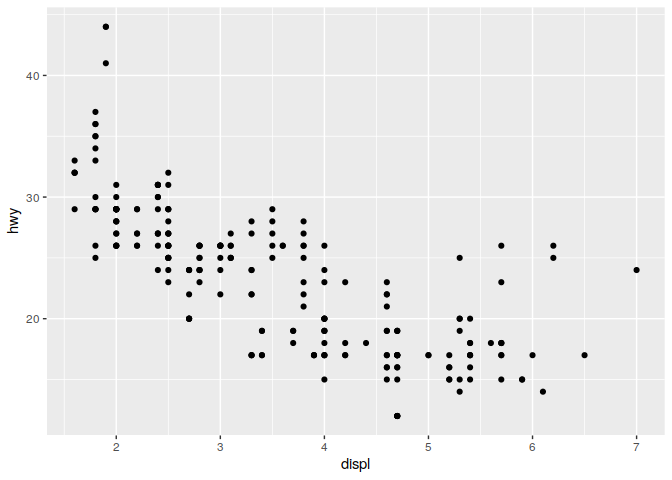
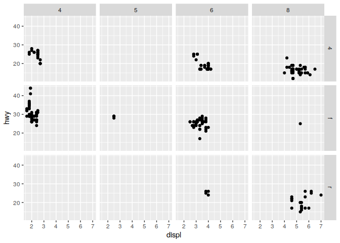
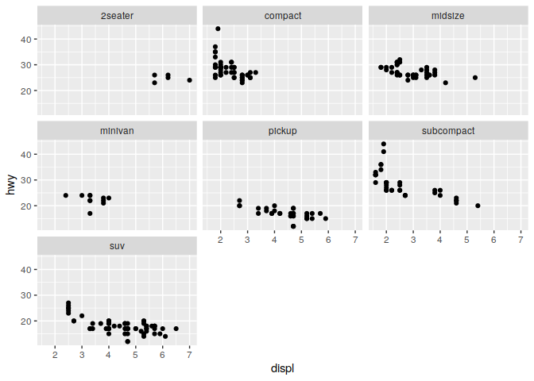
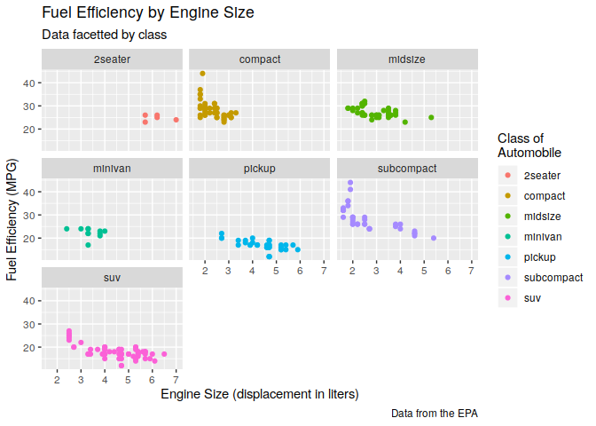
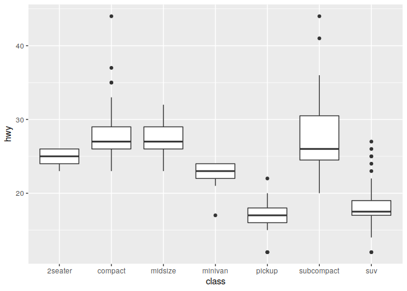
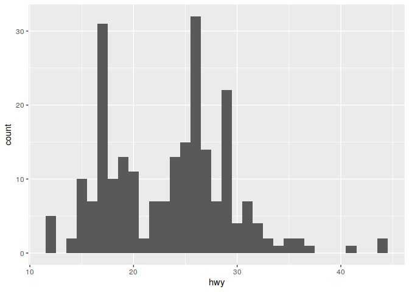
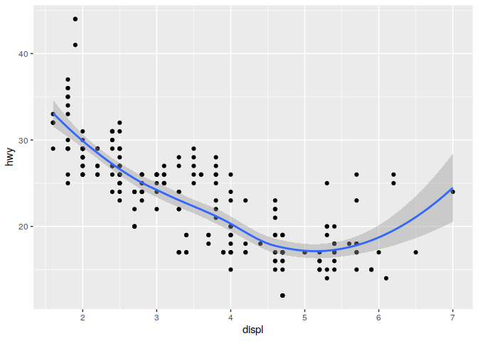
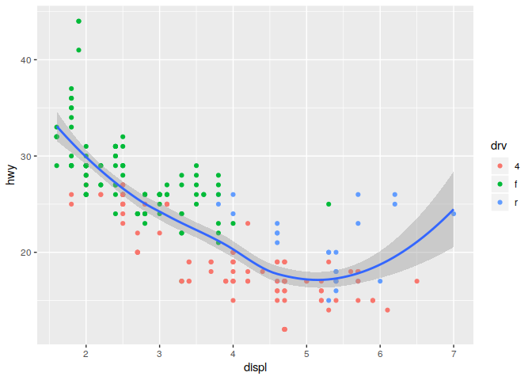
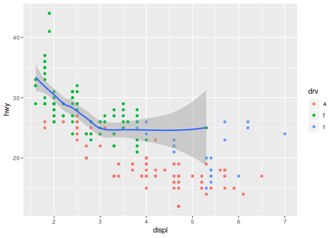

### Getting started with Tidyverse

Tidyverse is a set of package for doing data science.  [R for Data Science](https://r4ds.had.co.nz/index.html) by Garrett Grolemund, Hadley Wickham model Data Science in the following way.


We will start learning about Tidyverse tools by starting at the first step in this process, importing data.

*** 

### Step 1: Import data with the [readr](https://readr.tidyverse.org/) package 


> “The goal of 'readr' is to provide a fast and friendly way to read rectangular data (like 'csv', 'tsv', and 'fwf'). It is designed to flexibly parse many types of data found in the wild, while still cleanly failing when data unexpectedly changes.”

The readr package gets loaded automatically when you use library(tidyverse), or you can load it directly.

```r
library(readr)
```

***


#### readr supports a number of file formats with different read_* functions including:

* read_csv(): comma separated (CSV) files
* read_tsv(): tab separated files
* read_delim(): general delimited files (you must supply delimiter!)
* read_fwf(): fixed width files           
* read_table(): tabular files where columns are separated by white-space.
* read_log(): web log files

#### Readr also has functions write data in a number of formats with various write_* functions:

* write_csv(): comma separated (CSV) files
* write_tsv(): tab separated files
* write_delim(): general delimited files
* write_excel_csv(): comma separated files for Excel

*** 

#### Get some data and try out these functions:

Note that this data set is from the ggplot2 package. 


```r
download.file("https://raw.githubusercontent.com/ucdavis-bioinformatics-training/2019-Winter-Bioinformatics_Command_Line_and_R_Prerequisites_Workshop/master/Intro_to_R/Intro2R/mpg.tsv", "mpg.tsv")
```

The file has a ".tsv" extension, so it is probably a tab separated values file. Lets check this assumption in a few different ways.
Note that the output from the system() function does not appear in the markdown document, and this approach may not work on windows computers.

```r
getwd()
```

```
## [1] "/bio/CoreWork/workshops/2019-Winter-Bioinformatics_Command_Line_and_R_Prerequisites_Workshop/Intro_to_R/Intro2R"
```

```r
dir(pattern="*.tsv")
```

```
## [1] "mpg.tsv" "tmp.tsv"
```

```r
system('head mpg.tsv')

system('wc -l mpg.tsv')
```

Alternatively we could use another of the readr functions, **read_lines**, to look at the first few lines of the file:

```r
read_lines('mpg.tsv', n_max = 5)
```

```
## [1] "manufacturer\tmodel\tdispl\tyear\tcyl\ttrans\tdrv\tcty\thwy\tfl\tclass"
## [2] "audi\ta4\t1.8\t1999\t4\tauto(l5)\tf\t18\t29\tp\tcompact"               
## [3] "audi\ta4\t1.8\t1999\t4\tmanual(m5)\tf\t21\t29\tp\tcompact"             
## [4] "audi\ta4\t2\t2008\t4\tmanual(m6)\tf\t20\t31\tp\tcompact"               
## [5] "audi\ta4\t2\t2008\t4\tauto(av)\tf\t21\t30\tp\tcompact"
```


We could also check the number of lines by reading the whole file and counting the lines. This approach will be slow for large files:

```r
length(read_lines('mpg.tsv'))
```

```
## [1] 235
```


*How many lines does the file have?*


*What is the first line of the file?*


*What separates the values in the file?*

Read the file and store it in an object:

```r
mpg <- read_tsv('mpg.tsv')
```

```
## Parsed with column specification:
## cols(
##   manufacturer = col_character(),
##   model = col_character(),
##   displ = col_double(),
##   year = col_double(),
##   cyl = col_double(),
##   trans = col_character(),
##   drv = col_character(),
##   cty = col_double(),
##   hwy = col_double(),
##   fl = col_character(),
##   class = col_character()
## )
```

#### What are "Column Specifications"

Computers use different types of containers to store different types of data. In tidyverse all numeric data (floating point and integer) is [stored as a 64-bit double](https://www.tidyverse.org/blog/2018/12/readr-1-3-1/). Data that is not numeric is stored in character vectors. When reading a file, readr must make a guess about the type of data stored in each column. To do this, readr skims the [first 1000 lines](https://readr.tidyverse.org/articles/readr.html) of the file, investigating the values it finds there, and using them to make a guess at the format of the file.

*** 

#### Now lets look at the object we just loaded 

```r
mpg
```

```
## # A tibble: 234 x 11
##    manufacturer model    displ  year   cyl trans   drv     cty   hwy fl    class
##    <chr>        <chr>    <dbl> <dbl> <dbl> <chr>   <chr> <dbl> <dbl> <chr> <chr>
##  1 audi         a4         1.8  1999     4 auto(l… f        18    29 p     comp…
##  2 audi         a4         1.8  1999     4 manual… f        21    29 p     comp…
##  3 audi         a4         2    2008     4 manual… f        20    31 p     comp…
##  4 audi         a4         2    2008     4 auto(a… f        21    30 p     comp…
##  5 audi         a4         2.8  1999     6 auto(l… f        16    26 p     comp…
##  6 audi         a4         2.8  1999     6 manual… f        18    26 p     comp…
##  7 audi         a4         3.1  2008     6 auto(a… f        18    27 p     comp…
##  8 audi         a4 quat…   1.8  1999     4 manual… 4        18    26 p     comp…
##  9 audi         a4 quat…   1.8  1999     4 auto(l… 4        16    25 p     comp…
## 10 audi         a4 quat…   2    2008     4 manual… 4        20    28 p     comp…
## # … with 224 more rows
```


*Does the mpg object have the expected number of lines?*


### Detour for [Tibbles](https://tibble.tidyverse.org/) 

Tibbles are a modified type of data frame. Everything you have learned about accessing and manipulating data frames still applies, but a tibble behaves a little differently.

From <https://tibble.tidyverse.org/>

>A tibble, or tbl_df, is a modern reimagining of the data.frame, keeping what time has proven to be effective, and throwing out what is not. Tibbles are data.frames that are lazy and surly: they do less (i.e. they don’t change variable names or types, and don’t do partial matching) and complain more (e.g. when a variable does not exist). This forces you to confront problems earlier, typically leading to cleaner, more expressive code. Tibbles also have an enhanced print() method which makes them easier to use with large datasets containing complex objects.


#### Creating tibbles

Tibbles can be created from existing objects using as_tible()


```r
head(iris)
```

```
##   Sepal.Length Sepal.Width Petal.Length Petal.Width Species
## 1          5.1         3.5          1.4         0.2  setosa
## 2          4.9         3.0          1.4         0.2  setosa
## 3          4.7         3.2          1.3         0.2  setosa
## 4          4.6         3.1          1.5         0.2  setosa
## 5          5.0         3.6          1.4         0.2  setosa
## 6          5.4         3.9          1.7         0.4  setosa
```

```r
as_tibble(iris)
```

```
## # A tibble: 150 x 5
##    Sepal.Length Sepal.Width Petal.Length Petal.Width Species
##           <dbl>       <dbl>        <dbl>       <dbl> <fct>  
##  1          5.1         3.5          1.4         0.2 setosa 
##  2          4.9         3            1.4         0.2 setosa 
##  3          4.7         3.2          1.3         0.2 setosa 
##  4          4.6         3.1          1.5         0.2 setosa 
##  5          5           3.6          1.4         0.2 setosa 
##  6          5.4         3.9          1.7         0.4 setosa 
##  7          4.6         3.4          1.4         0.3 setosa 
##  8          5           3.4          1.5         0.2 setosa 
##  9          4.4         2.9          1.4         0.2 setosa 
## 10          4.9         3.1          1.5         0.1 setosa 
## # … with 140 more rows
```

Tibbles can also be created manually by specifying each column:


```r
tibble(
        column1=1:5,
        column2=c("a","b","c","d","e"),
        column3=pi*1:5
       )
```

```
## # A tibble: 5 x 3
##   column1 column2 column3
##     <int> <chr>     <dbl>
## 1       1 a          3.14
## 2       2 b          6.28
## 3       3 c          9.42
## 4       4 d         12.6 
## 5       5 e         15.7
```

Or row-by-row with tribble():

```r
tribble(
  ~x, ~y,  ~z,
  "a", 2,  3.6,
  "b", 1,  8.5
)
```

```
## # A tibble: 2 x 3
##   x         y     z
##   <chr> <dbl> <dbl>
## 1 a         2   3.6
## 2 b         1   8.5
```


Tibbles can have terrible column names that should never be used. **Good practice is to have unique column names that start with a letter and contain no special characters.**

```r
tibble(
  `terrible column 1` = 1:5,
  `no good :)` = letters[1:5],
  `;very-bad/` = sin(4:8)
)
```

```
## # A tibble: 5 x 3
##   `terrible column 1` `no good :)` `;very-bad/`
##                 <int> <chr>               <dbl>
## 1                   1 a                  -0.757
## 2                   2 b                  -0.959
## 3                   3 c                  -0.279
## 4                   4 d                   0.657
## 5                   5 e                   0.989
```


*** 

#### Readr and Tibble Exercises 

1) Create a tibble with 100 rows and 3 columns. Write it out using **write_tsv()**. Try to read it back in with **read_csv()**. Did it read in successfully? How does the new tibble look? Try to use **read_delim()** to read in the data correctly (hint, you will need to specify the proper delimeter).


2) Try to generate a *parsing failure* in readr. Based on what you know about how readr processes data, make a trecherous tibble. Write it out. Read it in again to generate the failure.


3) Take a look at the documentation for read_delim. Enter R code below that successfully loads the trecherous tibble you created in the last exercise.


*** 


### Step 2: Tidying data with [tidyr](https://tidyr.tidyverse.org/) package{width=100}


#### First, what is "tidy" data?
[**Wickham, Hadley. "Tidy data." Journal of Statistical Software 59.10 (2014): 1-23.**](https://vita.had.co.nz/papers/tidy-data.pdf)

> Tidy data is data where:
> 
> 1) Every column is a variable.
> 2) Every row is an observation.
> 3) Every cell is a single value.
> 
> Tidy data describes a standard way of storing data that is used wherever possible throughout the tidyverse. If you ensure that your data is tidy, you’ll spend less time fighting with the tools and more time working on your analysis.


Definitions:

* A **variable** stores a set of values of a particular type (height, temperature, duration)

* An **observation** is all values measured on the same unit across variables

***

#### Lets make a data set:

```r
d1 = data.frame(
        sample = rep(c("sample1","sample2","sample3"), 2),
        trt = rep(c('a','b'), each=3),
        result = c(4,6,9,8,5,4)
)
d1
```

```
##    sample trt result
## 1 sample1   a      4
## 2 sample2   a      6
## 3 sample3   a      9
## 4 sample1   b      8
## 5 sample2   b      5
## 6 sample3   b      4
```

**Is this tidy?**

1) Every column is a variable?
  
2) Every row is an observation?
  
3) Every cell is a single value?

4) What are the variables?

5) What are the observations:?


***

#### Lets make another data set:

```r
d2 <- data.frame(
        sample1=c(4,8),
        sample2=c(6,5),
        sample3=c(9,4)
)
rownames(d2) <- c("a","b")
d2
```

```
##   sample1 sample2 sample3
## a       4       6       9
## b       8       5       4
```
**Is this tidy?**

1) Every column is a variable?
  
2) Every row is an observation?
  
3) Every cell is a single value?

4) What are the variables?

5) What are the observations?

***

#### How can we make d2 look like d1 (make d2 tidy)?

First, make the row names into a new column with the **rownames_to_column()** function:

```r
d2.1 <- rownames_to_column(d2, 'trt')
d2.1
```

```
##   trt sample1 sample2 sample3
## 1   a       4       6       9
## 2   b       8       5       4
```

Make each row an observation with **pivot_longer()** function:

```r
d2.2 <- pivot_longer(d2.1, cols = -trt, names_to = "sample", values_to = "result")
d2.2
```

```
## # A tibble: 6 x 3
##   trt   sample  result
##   <chr> <chr>    <dbl>
## 1 a     sample1      4
## 2 a     sample2      6
## 3 a     sample3      9
## 4 b     sample1      8
## 5 b     sample2      5
## 6 b     sample3      4
```

Reorder columns for looks using **select()** function:

```r
d2.3 <- select(d2.2, sample, trt, result)
d2.3
```

```
## # A tibble: 6 x 3
##   sample  trt   result
##   <chr>   <chr>  <dbl>
## 1 sample1 a          4
## 2 sample2 a          6
## 3 sample3 a          9
## 4 sample1 b          8
## 5 sample2 b          5
## 6 sample3 b          4
```

***

### Detour for [magrittr](https://magrittr.tidyverse.org/) and the %>% operator  
Although the code above is fairly readable, it is not compact. It also creates three copies of the data (d2.1, d2.2, d2.3). We could use a couple of different strategies for carrying out this series of operations in a more concise manner.

#### Option 1, the base-R strategy, Nested Functions
Traditionally, R users have used nested functions to skip the creation of intermediary objects:

```r
d2.3 <- select( pivot_longer(rownames_to_column(d2, 'trt'), 
                              cols = -trt, names_to = "sample", values_to = "result"), 
                               sample, trt, result)
d2.3
```

```
## # A tibble: 6 x 3
##   sample  trt   result
##   <chr>   <chr>  <dbl>
## 1 sample1 a          4
## 2 sample2 a          6
## 3 sample3 a          9
## 4 sample1 b          8
## 5 sample2 b          5
## 6 sample3 b          4
```


#### Option 2, using the %>% pipe operator (also known as syntactic sugar)

> The magrittr package offers a set* of operators which make your code more readable by:
> 
> * structuring sequences of data operations left-to-right (as opposed to from the inside and out),
> * avoiding nested function calls,
> * minimizing the need for local variables and function definitions, and
> * making it easy to add steps anywhere in the sequence of operations.

*we will only look at one


```r
d2.3 <- 
  d2 %>% rownames_to_column('trt') %>% 
    pivot_longer(cols = -trt, names_to = "sample", values_to = "result") %>% 
    select(sample, trt, result)
d2.3
```

```
## # A tibble: 6 x 3
##   sample  trt   result
##   <chr>   <chr>  <dbl>
## 1 sample1 a          4
## 2 sample2 a          6
## 3 sample3 a          9
## 4 sample1 b          8
## 5 sample2 b          5
## 6 sample3 b          4
```

Does either one look more readable to you?

#### How does %>% work?

By default, %>% works to replace the first argument in a function with the left-hand side value with basic piping:

* x %>% f is equivalent to f(x)
* x %>% f(y) is equivalent to f(x, y)
* x %>% f %>% g %>% h is equivalent to h(g(f(x)))

In more complicated situations you can also specify the argument to pipe to using the argument placeholder:

* x %>% f(y, .) is equivalent to f(y, x)
* x %>% f(y, z = .) is equivalent to f(y, z = x)

***

#### Reverting to wide data format can be done with **pivot_wider()**, it does the inverse transformation of **pivot_longer()** and adds columns by removing rows.

For example:

```r
d1
```

```
##    sample trt result
## 1 sample1   a      4
## 2 sample2   a      6
## 3 sample3   a      9
## 4 sample1   b      8
## 5 sample2   b      5
## 6 sample3   b      4
```


```r
pivot_wider(d1, names_from = sample, values_from = result )
```

```
## # A tibble: 2 x 4
##   trt   sample1 sample2 sample3
##   <fct>   <dbl>   <dbl>   <dbl>
## 1 a           4       6       9
## 2 b           8       5       4
```

Note that **pivot_longer()** and **pivot_wider()** replace the old functionality in **spread()** and **gather()**, and also have similar functionality to **melt()** and **cast()** from the reshape2 package. [You can read more about this on r-bloggers](https://www.r-bloggers.com/using-r-from-gather-to-pivot/). 

***

#### Sometimes a column contains two variables split by a delimiter, **separate()** can be used to create two columns from this single input

Lets practice on table3 from the tidyr package:

```r
table3
```

```
## # A tibble: 6 x 3
##   country      year rate             
## * <chr>       <int> <chr>            
## 1 Afghanistan  1999 745/19987071     
## 2 Afghanistan  2000 2666/20595360    
## 3 Brazil       1999 37737/172006362  
## 4 Brazil       2000 80488/174504898  
## 5 China        1999 212258/1272915272
## 6 China        2000 213766/1280428583
```

The third column **rate** contains two different values, **cases** and **population**. We can use the **separate()** function to split these into two columns.

```r
separate(data = table3, col = rate, into = c("cases", "population"), sep = '/')
```

```
## # A tibble: 6 x 4
##   country      year cases  population
##   <chr>       <int> <chr>  <chr>     
## 1 Afghanistan  1999 745    19987071  
## 2 Afghanistan  2000 2666   20595360  
## 3 Brazil       1999 37737  172006362 
## 4 Brazil       2000 80488  174504898 
## 5 China        1999 212258 1272915272
## 6 China        2000 213766 1280428583
```


#### tidyr exercises


1) The tidyr package comes with a relig_income dataset. Use tidyr functions to make it into a tidy dataset. What are the variables? What are the observations?


2) The tidyr package come with a table2 dataset. What is wrong with this dataset? How many rows does it have per observation? Use tidyr functions to make it into a tidy dataset.


3) Use %>% and a set of pivot_wider and pivot_longer calls to convert d2 into d1 and then back into d2 again (round trip).


***

### Step 3, Transforming data with dplyr 


dplyr provides a set of verbs for modifying, combining, and otherwise transforming variables, creating subsets based on various attributes, combining multiple tibbles, etc. These approaches are meant to enable efficient manipulation of data.

To demonstrate some of them we will use the starwars dataset included in the dplyr package.


```r
library(dplyr)
starwars
```

```
## # A tibble: 87 x 13
##    name  height  mass hair_color skin_color eye_color birth_year gender
##    <chr>  <int> <dbl> <chr>      <chr>      <chr>          <dbl> <chr> 
##  1 Luke…    172    77 blond      fair       blue            19   male  
##  2 C-3PO    167    75 <NA>       gold       yellow         112   <NA>  
##  3 R2-D2     96    32 <NA>       white, bl… red             33   <NA>  
##  4 Dart…    202   136 none       white      yellow          41.9 male  
##  5 Leia…    150    49 brown      light      brown           19   female
##  6 Owen…    178   120 brown, gr… light      blue            52   male  
##  7 Beru…    165    75 brown      light      blue            47   female
##  8 R5-D4     97    32 <NA>       white, red red             NA   <NA>  
##  9 Bigg…    183    84 black      light      brown           24   male  
## 10 Obi-…    182    77 auburn, w… fair       blue-gray       57   male  
## # … with 77 more rows, and 5 more variables: homeworld <chr>, species <chr>,
## #   films <list>, vehicles <list>, starships <list>
```


* mutate() adds new variables that are functions of existing variables. Lets use this to calculate the [BMI](https://www.cdc.gov/healthyweight/assessing/bmi/adult_bmi/index.html) of characters in the Starwars universe (note that this equation may be incorrect for androids).


```r
starwars %>% mutate(BMI = mass / (height/100))
```

```
## # A tibble: 87 x 14
##    name  height  mass hair_color skin_color eye_color birth_year gender
##    <chr>  <int> <dbl> <chr>      <chr>      <chr>          <dbl> <chr> 
##  1 Luke…    172    77 blond      fair       blue            19   male  
##  2 C-3PO    167    75 <NA>       gold       yellow         112   <NA>  
##  3 R2-D2     96    32 <NA>       white, bl… red             33   <NA>  
##  4 Dart…    202   136 none       white      yellow          41.9 male  
##  5 Leia…    150    49 brown      light      brown           19   female
##  6 Owen…    178   120 brown, gr… light      blue            52   male  
##  7 Beru…    165    75 brown      light      blue            47   female
##  8 R5-D4     97    32 <NA>       white, red red             NA   <NA>  
##  9 Bigg…    183    84 black      light      brown           24   male  
## 10 Obi-…    182    77 auburn, w… fair       blue-gray       57   male  
## # … with 77 more rows, and 6 more variables: homeworld <chr>, species <chr>,
## #   films <list>, vehicles <list>, starships <list>, BMI <dbl>
```

* Perhaps we are only interested in a subset of columns. **select()** allows us to select columns based on name or index.


```r
starwars %>% mutate(BMI = mass / (height/100)) %>% select(name, species, BMI)
```

```
## # A tibble: 87 x 3
##    name               species   BMI
##    <chr>              <chr>   <dbl>
##  1 Luke Skywalker     Human    44.8
##  2 C-3PO              Droid    44.9
##  3 R2-D2              Droid    33.3
##  4 Darth Vader        Human    67.3
##  5 Leia Organa        Human    32.7
##  6 Owen Lars          Human    67.4
##  7 Beru Whitesun lars Human    45.5
##  8 R5-D4              Droid    33.0
##  9 Biggs Darklighter  Human    45.9
## 10 Obi-Wan Kenobi     Human    42.3
## # … with 77 more rows
```

* Before we calculate any summary statistics, lets check to see if we have appropriate levels of replication. We can determine the number of samples per species using **cout()** 


```r
starwars %>% count(species, sort=T, name = "Samples")
```

```
## # A tibble: 38 x 2
##    species  Samples
##    <chr>      <int>
##  1 Human         35
##  2 Droid          5
##  3 <NA>           5
##  4 Gungan         3
##  5 Kaminoan       2
##  6 Mirialan       2
##  7 Twi'lek        2
##  8 Wookiee        2
##  9 Zabrak         2
## 10 Aleena         1
## # … with 28 more rows
```

* Species information is missing for a number of samples, lets remove these with **drop_na()**, and also remove any samples for which mass or height is NA.


```r
starwars %>% drop_na(species, mass, height) %>% count(species, sort=T, name = "Samples")
```

```
## # A tibble: 31 x 2
##    species  Samples
##    <chr>      <int>
##  1 Human         22
##  2 Droid          4
##  3 Gungan         2
##  4 Mirialan       2
##  5 Wookiee        2
##  6 Aleena         1
##  7 Besalisk       1
##  8 Cerean         1
##  9 Clawdite       1
## 10 Dug            1
## # … with 21 more rows
```

* Now lets combine a number of operators to calculate the mean BMI for all groups with at least three samples. We can drop observations for species for which there isn't sufficient replication using a combination of **filter()**, **group_by** and a special **n()** function.


```r
starwars %>% drop_na(species, mass, height) %>%  # remove all observations with missing data
  mutate(BMI = mass / (height/100)) %>%   # calculate BMI and add a new column
  group_by(species) %>% filter(n() >= 3) %>%  # filter observations belonging to species with < 3 samples
  summarize(mean_BMI = mean(BMI))  # calculate summary statistics
```

```
## # A tibble: 2 x 2
##   species mean_BMI
##   <chr>      <dbl>
## 1 Droid       45.3
## 2 Human       45.8
```

What can we learn from these results?

***


* We can use the **arrange()** and **slice()** functions to find the tallest observed inhabitant of each planet sampled:

```r
starwars %>% 
  arrange(homeworld, desc(height)) %>%  # sort by homeworld, then height descending
  group_by(homeworld) %>%  # use group_by to tell slice() how to select records
  slice(1)  # keep only the first observation per homeworld
```

```
## # A tibble: 49 x 13
## # Groups:   homeworld [49]
##    name  height  mass hair_color skin_color eye_color birth_year gender
##    <chr>  <int> <dbl> <chr>      <chr>      <chr>          <dbl> <chr> 
##  1 Bail…    191    NA black      tan        brown             67 male  
##  2 Ratt…     79    15 none       grey, blue unknown           NA male  
##  3 Lobot    175    79 none       light      blue              37 male  
##  4 Jek …    180   110 brown      fair       blue              NA male  
##  5 Nute…    191    90 none       mottled g… red               NA male  
##  6 Ki-A…    198    82 white      pale       yellow            92 male  
##  7 Mas …    196    NA none       blue       blue              NA male  
##  8 Mon …    150    NA auburn     fair       blue              48 female
##  9 Jang…    183    79 black      tan        brown             66 male  
## 10 Han …    180    80 brown      fair       brown             29 male  
## # … with 39 more rows, and 5 more variables: homeworld <chr>, species <chr>,
## #   films <list>, vehicles <list>, starships <list>
```


*** 

#### Exercises

Install the nycflights13 package and take a look at the **flights** dataset.


```r
if (!any(rownames(installed.packages()) == "nycflights13")){
  install.packages("nycflights13")
}
library(nycflights13)
```

```r
flights
```

```
## # A tibble: 336,776 x 19
##     year month   day dep_time sched_dep_time dep_delay arr_time sched_arr_time
##    <int> <int> <int>    <int>          <int>     <dbl>    <int>          <int>
##  1  2013     1     1      517            515         2      830            819
##  2  2013     1     1      533            529         4      850            830
##  3  2013     1     1      542            540         2      923            850
##  4  2013     1     1      544            545        -1     1004           1022
##  5  2013     1     1      554            600        -6      812            837
##  6  2013     1     1      554            558        -4      740            728
##  7  2013     1     1      555            600        -5      913            854
##  8  2013     1     1      557            600        -3      709            723
##  9  2013     1     1      557            600        -3      838            846
## 10  2013     1     1      558            600        -2      753            745
## # … with 336,766 more rows, and 11 more variables: arr_delay <dbl>,
## #   carrier <chr>, flight <int>, tailnum <chr>, origin <chr>, dest <chr>,
## #   air_time <dbl>, distance <dbl>, hour <dbl>, minute <dbl>, time_hour <dttm>
```


1) Assuming that people traveling for the Christmas/New Years holiday depart between December 20th and 24th, from which airport (EWR, JFK, LGA) did the most flights travel to San Francisco Airport (SFO)?


2) How many of these flights were delayed in departure by at least 30 minutes?


3) How many of these flights arrived late by at least 30 minutes?


4) What was the shortest in-flight time to SFO from each of the airports? 


5) Extra credit: answer questions 1, 2, and 3 using base R.


***


### Step 4, Visualise with ggplot2 


[ggplot2](https://ggplot2.tidyverse.org/) is a system for declaratively creating graphics, based on [The Grammar of Graphics](https://www.amazon.com/Grammar-Graphics-Statistics-Computing/dp/0387245448/ref=as_li_ss_tl?ie=UTF8&qid=1477928463&sr=8-1&keywords=the+grammar+of+graphics&linkCode=sl1&tag=ggplot2-20&linkId=f0130e557161b83fbe97ba0e9175c431). You provide the data, tell ggplot2 how to map variables to aesthetics, what graphical primitives to use, and it takes care of the details.

**Note that most of the material on GGPLOT2 was taken directly from [RStudio teaching resources](https://github.com/rstudio-education) that are made freely available online **

***

Lets start with a plot:

```r
ggplot(data = mpg) + 
  geom_point(mapping = aes(x=displ, y=hwy))
```

<!-- -->

#### A template for ggplot:

> ggplot(data = \<DATA\>) +
  \<GEOM_FUNCTION\>(mapping = aes(<MAPPING>) )


**Aesthetics** - visual property of something in a graph - color, shape, size
    Mapping connects values in the data to a visual indication in the plot.
    color, size, shape, alpha

**GEOM** Geometric object (geom_abline, geom_bar, geom_boxplot, geom_dotplot, etc)

### Aesthetic mapping defines how variables in the dataset are connected to visual properties of the plot.

Aesthetics can:

* Tell ggplot which variables are used on what axis
* Tell ggplot which shape to use for points on a plot
* Tell ggplot what color to make the points
* Tell ggplot what size to make the points
* Tell ggplot how transparent to make a point (alpha)
* etc

All off these mappings can be passed in to the aes() function.

#### Exercises

1) Create scatter plots from the mpg dataset. Experiment with mapping color, size, alpha and shape to different variables. 


2) How does the behavior of GGPLOT differ when you use the "class" variable vs the "cty" variable for color?


3) What happens when you use more than one aesthetic?


4) Create a tibble with x coordinates, y coordinates, 6 colors (color1-6), and 6 shapes (shape1-6), plot this tibble. Try to set the size of all points to something larger than the default.


5) What happens if you try to specify an aesthetic mapping outside of the aes() function? Does the behavior different depending on whether you use a variable from your tibble/data frame?


*** 

Plots can be built up piece by piece and only plotted when they are ready. 

This code will not produce a plot:

q <- ggplot(mpg) + geom_point(aes(x = displ, y = hwy))


**Facets** are another way to display groupings in your data. Only instead of color or shape, facets display each group in a different plot.


#### Exercises

1) Experiment with each of the modifications to the _q_ object below.

Write a brief description of how fact_grid works:

Write a brief description of how facet_wrap works:


```r
q <- ggplot(mpg) + geom_point(mapping = aes(x = displ, y = hwy))
q + facet_grid(. ~ cyl)
```

<!-- -->

```r
q + facet_grid(drv ~ .)
```

<!-- -->

```r
q + facet_grid(drv ~ cyl)
```

<!-- -->

```r
q + facet_wrap(~ class)
```

<!-- -->

2) What happens when you provide two varaiables to facet_wrap?


#### Lets update our ggplot template:

> ggplot(data = \<DATA\>) +
  \<GEOM_FUNCTION\>(mapping = aes(<MAPPING>)) +
  \<FACET_FUNCTION\>


#### Now lets add labels to our plots:

```r
ggplot(data = mpg) +
  geom_point(mapping = aes(displ, hwy, color = class)) +
  labs(title = "Fuel Efficiency by Engine Size",
    subtitle = "Data facetted by class",
    x = "Engine Size (displacement in liters)",
    y = "Fuel Efficiency (MPG)",
    color = "Class of\nAutomobile",
    caption = "Data from the EPA") + 
    facet_wrap(~ class)
```

<!-- -->

### Different geometric objects (geom)

GGPLOT supports many different types of geometric objects. Each provides a different way of presenting data. 

#### Boxplots

```r
ggplot(data = mpg) +
  geom_boxplot(mapping = aes(x = class, y = hwy))
```

<!-- -->

#### Boxplots (modify binwidth to get higher or lower resolution plots)

```r
ggplot(data = mpg) +
  geom_histogram(mapping = aes(x = hwy), binwidth=1)
```

<!-- -->


#### It is also possible to include multiple geometric shapes on a single plot 

```r
ggplot(mpg) +
  geom_point(aes(displ, hwy)) +
  geom_smooth(aes(displ, hwy))
```

```
## `geom_smooth()` using method = 'loess' and formula 'y ~ x'
```

<!-- -->


#### Global vs local varaibles can be used to change the behavior of plots
Notice how the coloring of the points only impacts the geom_point geom, but does not impact geom_smooth

```r
ggplot(data = mpg, mapping = aes(x = displ, y = hwy)) +
  geom_point(mapping = aes(color = drv)) +
  geom_smooth()
```

```
## `geom_smooth()` using method = 'loess' and formula 'y ~ x'
```

<!-- -->


#### This concept of global and local also applied to data. If you only want a subset of your data plotted by one of your geoms, you can specify a second data set inside of the function call to that geom.


```r
ggplot(data = mpg, mapping = aes(x = displ, y = hwy)) +
  geom_point(mapping = aes(color = drv)) +
  geom_smooth(data = filter(mpg, drv == "f"))
```

```
## `geom_smooth()` using method = 'loess' and formula 'y ~ x'
```

<!-- -->


#### Once your plot is perfect, you want to save it. 

Option 1, using base-R png() or pdf() functions:

```r
pdf(file="my-plot1.pdf", width=5, height=5)
ggplot(data = mpg, mapping = aes(x = displ, y = hwy)) +
  geom_point(mapping = aes(color = drv)) +
  geom_smooth()
```

```
## `geom_smooth()` using method = 'loess' and formula 'y ~ x'
```

```r
dev.off()
```

```
## png 
##   2
```

```r
png(file="myplot.png", width=500, height=500)
ggplot(data = mpg, mapping = aes(x = displ, y = hwy)) +
  geom_point(mapping = aes(color = drv)) +
  geom_smooth()
```

```
## `geom_smooth()` using method = 'loess' and formula 'y ~ x'
```

```r
dev.off()
```

```
## png 
##   2
```


Option 2, using the ggsave function to save the last plot made:

```r
p <- ggplot(data = mpg, mapping = aes(x = displ, y = hwy)) +
  geom_point(mapping = aes(color = drv)) +
  geom_smooth()

ggsave(file = "myplot3.pdf", width=5, height=5, plot=p)
```

```
## `geom_smooth()` using method = 'loess' and formula 'y ~ x'
```


#### Exercises

1) Visit <https://rstudio.cloud/learn/cheat-sheets> and download the Data Visualization cheatsheet. Choose five different **geoms** to experiment with. Try to get a good mix of one variable, two variables, continuous, and discrete.


#### Putting it all together / something to keep you from getting bored over the holidays

Visit <http://varianceexplained.org/r/tidy-genomics/> and work through the example. How many of the commands do you recognize from 

