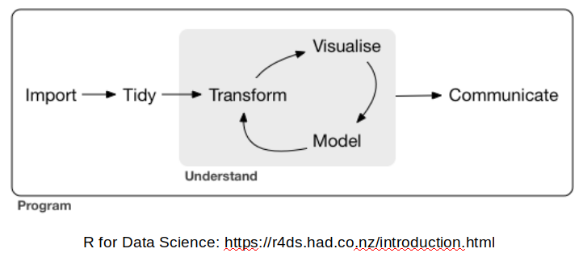

### Getting started with Tidyverse

Tidyverse is a set of package for doing data science.  [R for Data Science](https://r4ds.had.co.nz/index.html) by Garrett Grolemund, Hadley Wickham model Data Science in the following way.




We will start learning about Tidyverse tools by starting at the first step in this process, importing data.

*** 

### Step 1: Import data with the [readr](https://readr.tidyverse.org/) package {width=100px}


> “The goal of 'readr' is to provide a fast and friendly way to read rectangular data (like 'csv', 'tsv', and 'fwf'). It is designed to flexibly parse many types of data found in the wild, while still cleanly failing when data unexpectedly changes.”

The readr package gets loaded automatically when you use library(tidyverse), or you can load it directly.

```r
library(readr)
```

***


#### readr supports a number of file formats with different read_* functions including:

* read_csv(): comma separated (CSV) files
* read_tsv(): tab separated files
* read_delim(): general delimited files (you must supply delimiter!)
* read_fwf(): fixed width files           
* read_table(): tabular files where columns are separated by white-space.
* read_log(): web log files

#### Readr also has functions write data in a number of formats with various write_* functions:

* write_csv(): comma separated (CSV) files
* write_tsv(): tab separated files
* write_delim(): general delimited files
* write_excel_csv(): comma separated files for Excel

*** 

#### Get some data and try out these functions:

Note that this data set is from the ggplot2 package. 


```r
download.file("https://raw.githubusercontent.com/ucdavis-bioinformatics-training/2019-Winter-Bioinformatics_Command_Line_and_R_Prerequisites_Workshop/master/Intro_to_R/Intro2R/mpg.tsv", "mpg.tsv")
```

The file has a ".tsv" extension, so it is probably a tab separated values file. Lets check this assumption in a few different ways.
Note that the output from the system() function does not appear in the markdown document, and this approach may not work on windows computers.

```r
getwd()
```

<div class='r_output'> [1] "/bio/CoreWork/workshops/2019-Winter-Bioinformatics_Command_Line_and_R_Prerequisites_Workshop/Intro_to_R/Intro2R"
</div>
```r
dir(pattern="*.tsv")
```

<div class='r_output'> [1] "mpg.tsv" "tmp.tsv"
</div>
```r
system('head mpg.tsv')

system('wc -l mpg.tsv')
```

Alternatively we could use another of the readr functions, **read_lines**, to look at the first few lines of the file:

```r
read_lines('mpg.tsv', n_max = 5)
```

<div class='r_output'> [1] "manufacturer\tmodel\tdispl\tyear\tcyl\ttrans\tdrv\tcty\thwy\tfl\tclass"
 [2] "audi\ta4\t1.8\t1999\t4\tauto(l5)\tf\t18\t29\tp\tcompact"               
 [3] "audi\ta4\t1.8\t1999\t4\tmanual(m5)\tf\t21\t29\tp\tcompact"             
 [4] "audi\ta4\t2\t2008\t4\tmanual(m6)\tf\t20\t31\tp\tcompact"               
 [5] "audi\ta4\t2\t2008\t4\tauto(av)\tf\t21\t30\tp\tcompact"
</div>

We could also check the number of lines by reading the whole file and counting the lines. This approach will be slow for large files:

```r
length(read_lines('mpg.tsv'))
```

<div class='r_output'> [1] 235
</div>

*How many lines does the file have?*


*What is the first line of the file?*


*What separates the values in the file?*

Read the file and store it in an object:

```r
mpg <- read_tsv('mpg.tsv')
```

<div class='r_output'> Parsed with column specification:
 cols(
   manufacturer = col_character(),
   model = col_character(),
   displ = col_double(),
   year = col_double(),
   cyl = col_double(),
   trans = col_character(),
   drv = col_character(),
   cty = col_double(),
   hwy = col_double(),
   fl = col_character(),
   class = col_character()
 )
</div>
#### What are "Column Specifications"

Computers use different types of containers to store different types of data. In tidyverse all numeric data (floating point and integer) is [stored as a 64-bit double](https://www.tidyverse.org/blog/2018/12/readr-1-3-1/). Data that is not numeric is stored in character vectors. When reading a file, readr must make a guess about the type of data stored in each column. To do this, readr skims the [first 1000 lines](https://readr.tidyverse.org/articles/readr.html) of the file, investigating the values it finds there, and using them to make a guess at the format of the file.

*** 

#### Now lets look at the object we just loaded 

```r
mpg
```

<div class='r_output'> # A tibble: 234 x 11
    manufacturer model    displ  year   cyl trans   drv     cty   hwy fl    class
    <chr>        <chr>    <dbl> <dbl> <dbl> <chr>   <chr> <dbl> <dbl> <chr> <chr>
  1 audi         a4         1.8  1999     4 auto(l… f        18    29 p     comp…
  2 audi         a4         1.8  1999     4 manual… f        21    29 p     comp…
  3 audi         a4         2    2008     4 manual… f        20    31 p     comp…
  4 audi         a4         2    2008     4 auto(a… f        21    30 p     comp…
  5 audi         a4         2.8  1999     6 auto(l… f        16    26 p     comp…
  6 audi         a4         2.8  1999     6 manual… f        18    26 p     comp…
  7 audi         a4         3.1  2008     6 auto(a… f        18    27 p     comp…
  8 audi         a4 quat…   1.8  1999     4 manual… 4        18    26 p     comp…
  9 audi         a4 quat…   1.8  1999     4 auto(l… 4        16    25 p     comp…
 10 audi         a4 quat…   2    2008     4 manual… 4        20    28 p     comp…
 # … with 224 more rows
</div>
*Does the mpg object have the expected number of lines?*


### Detour for [Tibbles](https://tibble.tidyverse.org/) {width=100}

Tibbles are a modified type of data frame. Everything you have learned about accessing and manipulating data frames still applies, but a tibble behaves a little differently.

From <https://tibble.tidyverse.org/>

>A tibble, or tbl_df, is a modern reimagining of the data.frame, keeping what time has proven to be effective, and throwing out what is not. Tibbles are data.frames that are lazy and surly: they do less (i.e. they don’t change variable names or types, and don’t do partial matching) and complain more (e.g. when a variable does not exist). This forces you to confront problems earlier, typically leading to cleaner, more expressive code. Tibbles also have an enhanced print() method which makes them easier to use with large datasets containing complex objects.


#### Creating tibbles

Tibbles can be created from existing objects using as_tible()


```r
head(iris)
```

<div class='r_output'>   Sepal.Length Sepal.Width Petal.Length Petal.Width Species
 1          5.1         3.5          1.4         0.2  setosa
 2          4.9         3.0          1.4         0.2  setosa
 3          4.7         3.2          1.3         0.2  setosa
 4          4.6         3.1          1.5         0.2  setosa
 5          5.0         3.6          1.4         0.2  setosa
 6          5.4         3.9          1.7         0.4  setosa
</div>
```r
as_tibble(iris)
```

<div class='r_output'> # A tibble: 150 x 5
    Sepal.Length Sepal.Width Petal.Length Petal.Width Species
           <dbl>       <dbl>        <dbl>       <dbl> <fct>  
  1          5.1         3.5          1.4         0.2 setosa 
  2          4.9         3            1.4         0.2 setosa 
  3          4.7         3.2          1.3         0.2 setosa 
  4          4.6         3.1          1.5         0.2 setosa 
  5          5           3.6          1.4         0.2 setosa 
  6          5.4         3.9          1.7         0.4 setosa 
  7          4.6         3.4          1.4         0.3 setosa 
  8          5           3.4          1.5         0.2 setosa 
  9          4.4         2.9          1.4         0.2 setosa 
 10          4.9         3.1          1.5         0.1 setosa 
 # … with 140 more rows
</div>
Tibbles can also be created manually by specifying each column:


```r
tibble(
        column1=1:5,
        column2=c("a","b","c","d","e"),
        column3=pi*1:5
       )
```

<div class='r_output'> # A tibble: 5 x 3
   column1 column2 column3
     <int> <chr>     <dbl>
 1       1 a          3.14
 2       2 b          6.28
 3       3 c          9.42
 4       4 d         12.6 
 5       5 e         15.7
</div>
Or row-by-row with tribble():{width=100} 

```r
tribble(
  ~x, ~y,  ~z,
  "a", 2,  3.6,
  "b", 1,  8.5
)
```

<div class='r_output'> # A tibble: 2 x 3
   x         y     z
   <chr> <dbl> <dbl>
 1 a         2   3.6
 2 b         1   8.5
</div>

Tibbles can have terrible column names that should never be used. **Good practice is to have unique column names that start with a letter and contain no special characters.**

```r
tibble(
  `terrible column 1` = 1:5,
  `no good :)` = letters[1:5],
  `;very-bad/` = sin(4:8)
)
```

<div class='r_output'> # A tibble: 5 x 3
   `terrible column 1` `no good :)` `;very-bad/`
                 <int> <chr>               <dbl>
 1                   1 a                  -0.757
 2                   2 b                  -0.959
 3                   3 c                  -0.279
 4                   4 d                   0.657
 5                   5 e                   0.989
</div>

*** 

#### Readr and Tibble Exercises 

1) Create a tibble with 100 rows and 3 columns. Write it out using **write_tsv()**. Try to read it back in with **read_csv()**. Did it read in successfully? How does the new tibble look? Try to use **read_delim()** to read in the data correctly (hint, you will need to specify a delim).


2) Try to generate a *parsing failure* in readr.  Based on what you know about how readr processes data, make a trecherous tibble. Write it out. Read it in again to generate the failure.


2) Take a look at the documentation for read_delim. Enter R code below that successfully loads the trecherous tibble you created in the last exercise.


*** 


### Step 2: Tidying data with [tidyr](https://tidyr.tidyverse.org/) package{width=100}


#### First, what is "tidy" data?
[**Wickham, Hadley. "Tidy data." Journal of Statistical Software 59.10 (2014): 1-23.**](https://vita.had.co.nz/papers/tidy-data.pdf)

> Tidy data is data where:
> 
> 1) Every column is a variable.
> 2) Every row is an observation.
> 3) Every cell is a single value.
> 
> Tidy data describes a standard way of storing data that is used wherever possible throughout the tidyverse. If you ensure that your data is tidy, you’ll spend less time fighting with the tools and more time working on your analysis.


Definitions:

* A **variable** stores a set of values of a particular type (height, temperature, duration)

* An **observation** all values measured on the same unit across variables

***

#### Lets make a data set:

```r
d1 = data.frame(
        sample = rep(c("sample1","sample2","sample3"), 2),
        trt = rep(c('a','b'), each=3),
        result = c(4,6,9,8,5,4)
)
d1
```

<div class='r_output'>    sample trt result
 1 sample1   a      4
 2 sample2   a      6
 3 sample3   a      9
 4 sample1   b      8
 5 sample2   b      5
 6 sample3   b      4
</div>**Is this tidy?**

1) Every column is a variable?
  
2) Every row is an observation?
  
3) Every cell is a single value?

4) What are the variables?

5) What are the observations:?


***

#### Lets make another data set:

```r
d2 <- data.frame(
        sample1=c(4,8),
        sample2=c(6,5),
        sample3=c(9,4)
)
rownames(d2) <- c("a","b")
d2
```

<div class='r_output'>   sample1 sample2 sample3
 a       4       6       9
 b       8       5       4
</div>**Is this tidy?**

1) Every column is a variable?
  
2) Every row is an observation?
  
3) Every cell is a single value?

4) What are the variables?

5) What are the observations?

***

#### How can we make d2 look like d1 (make d2 tidy)?

First, make the row names into a new column with the **rownames_to_column()** function:

```r
d2.1 <- rownames_to_column(d2, 'trt')
d2.1
```

<div class='r_output'>   trt sample1 sample2 sample3
 1   a       4       6       9
 2   b       8       5       4
</div>
Make each row an observation with **pivot_longer()** function:

```r
d2.2 <- pivot_longer(d2.1, cols = -trt, names_to = "sample", values_to = "result")
d2.2
```

<div class='r_output'> # A tibble: 6 x 3
   trt   sample  result
   <chr> <chr>    <dbl>
 1 a     sample1      4
 2 a     sample2      6
 3 a     sample3      9
 4 b     sample1      8
 5 b     sample2      5
 6 b     sample3      4
</div>
Reorder columns for looks using **select()** function:

```r
d2.3 <- select(d2.2, sample, trt, result)
d2.3
```

<div class='r_output'> # A tibble: 6 x 3
   sample  trt   result
   <chr>   <chr>  <dbl>
 1 sample1 a          4
 2 sample2 a          6
 3 sample3 a          9
 4 sample1 b          8
 5 sample2 b          5
 6 sample3 b          4
</div>
***

### Detour for [magrittr](https://magrittr.tidyverse.org/) and the %>% operator {width=100} 
Although the code above is fairly readable, it is not compact. It also creates three copies of the data (d2.1, d2.2, d2.3). We could use a couple of different strategies for carrying out this series of operations in a more concise manner.

#### Option 1, the base-R strategy, Nested Functions
Traditionally, R users have used nested functions to skip the creation of intermediary objects:

```r
d2.3 <- select( pivot_longer(rownames_to_column(d2, 'trt'), 
                              cols = -trt, names_to = "sample", values_to = "result"), 
                               sample, trt, result)
d2.3
```

<div class='r_output'> # A tibble: 6 x 3
   sample  trt   result
   <chr>   <chr>  <dbl>
 1 sample1 a          4
 2 sample2 a          6
 3 sample3 a          9
 4 sample1 b          8
 5 sample2 b          5
 6 sample3 b          4
</div>

#### Option 2, using the %>% pipe operator (syntactic sugar)

> The magrittr package offers a set* of operators which make your code more readable by:
> 
> * structuring sequences of data operations left-to-right (as opposed to from the inside and out),
> * avoiding nested function calls,
> * minimizing the need for local variables and function definitions, and
> * making it easy to add steps anywhere in the sequence of operations.

*we will only look at one


```r
d2.3 <- 
  d2 %>% rownames_to_column('trt') %>% 
    pivot_longer(cols = -trt, names_to = "sample", values_to = "result") %>% 
    select(sample, trt, result)
d2.3
```

<div class='r_output'> # A tibble: 6 x 3
   sample  trt   result
   <chr>   <chr>  <dbl>
 1 sample1 a          4
 2 sample2 a          6
 3 sample3 a          9
 4 sample1 b          8
 5 sample2 b          5
 6 sample3 b          4
</div>
Does either one look more readable to you?

#### How does %>% work?

By default, %>% works to replace the first argument in a function with the left-hand side value with basic piping:

* x %>% f is equivalent to f(x)
* x %>% f(y) is equivalent to f(x, y)
* x %>% f %>% g %>% h is equivalent to h(g(f(x)))

In more complicated situations you can also specify the argument to pipe to using the argument placeholder:

* x %>% f(y, .) is equivalent to f(y, x)
* x %>% f(y, z = .) is equivalent to f(y, z = x)

#### More tidyr functions

Tidyr comes with a number of additional functions to help with manipulating data.


* **pivot_wider()** does the inverse transformation of **pivot_longer()**, add columns by removing rows.

For example:

```r
d1
```

<div class='r_output'>    sample trt result
 1 sample1   a      4
 2 sample2   a      6
 3 sample3   a      9
 4 sample1   b      8
 5 sample2   b      5
 6 sample3   b      4
</div>

```r
pivot_wider(d1, names_from = sample, values_from = result )
```

<div class='r_output'> # A tibble: 2 x 4
   trt   sample1 sample2 sample3
   <fct>   <dbl>   <dbl>   <dbl>
 1 a           4       6       9
 2 b           8       5       4
</div>
Note that **pivot_longer()** and **pivot_wider()** replace the old functionality in **spread()** and **gather()**, and also have similar functionality to **melt()** and **cast()** from the reshape2 package. [You can read more about this on r-bloggers](https://www.r-bloggers.com/using-r-from-gather-to-pivot/).

* **separate()** turns a single character column into multiple columns. This can be handy when a single column contains two different pieces of data.

Lets practice on table3 from the tidyr package:

```r
table3
```

<div class='r_output'> # A tibble: 6 x 3
   country      year rate             
 * <chr>       <int> <chr>            
 1 Afghanistan  1999 745/19987071     
 2 Afghanistan  2000 2666/20595360    
 3 Brazil       1999 37737/172006362  
 4 Brazil       2000 80488/174504898  
 5 China        1999 212258/1272915272
 6 China        2000 213766/1280428583
</div>
The third column **rate** contains two different values, **cases** and **population**. Wecan 

```r
separate(data = table3, col = rate, into = c("cases", "population"), sep = '/')
```

<div class='r_output'> # A tibble: 6 x 4
   country      year cases  population
   <chr>       <int> <chr>  <chr>     
 1 Afghanistan  1999 745    19987071  
 2 Afghanistan  2000 2666   20595360  
 3 Brazil       1999 37737  172006362 
 4 Brazil       2000 80488  174504898 
 5 China        1999 212258 1272915272
 6 China        2000 213766 1280428583
</div>

#### tidyr exercises
https://tidyr.tidyverse.org/articles/tidy-data.html

1) The tidyr package comes with a relig_income dataset. Use tidyr functions to make it into a tidy dataset. What are the variables? What are the observations?


2) The tidyr package come with a table2 dataset. What is wrong with this dataset? How many rows does it have per observation? Use tidyr functions to make it into a tidy dataset.


### dplyr


### stringr


### ggplot2


### Real data example


# TODO:
#download.file("https://raw.githubusercontent.com/ucdavis-bioinformatics-training/2019-Winter-Bioinformatics_Command_Line_and_R_Prerequisites_Workshop/master/Intro_to_R/Intro2R/Is_10.gff3", "Is_10.gff3")


# Ixodes scapularis

# gff <- read_tsv("Is_10.gff3", col_names = F) 
# colnames(gff) = c("seqid", "source", "type", "start", "end", "score", "strand", "phase", "attributes")
# head(gff)

# gff$attributes[1]
# ```

# ```{r}
# separate(data = gff, col = attributes, )
# ```
