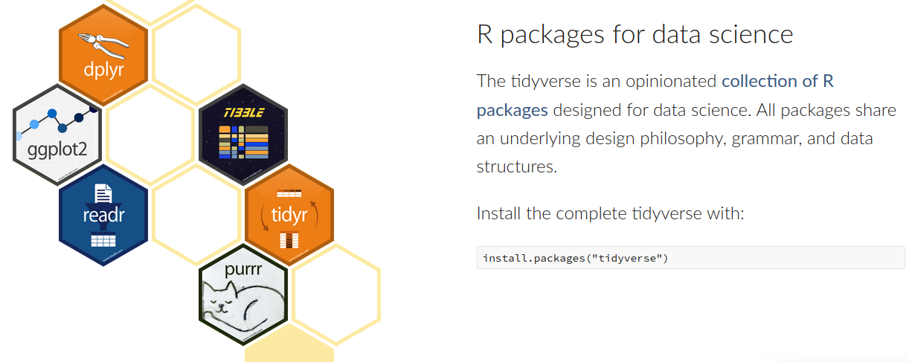
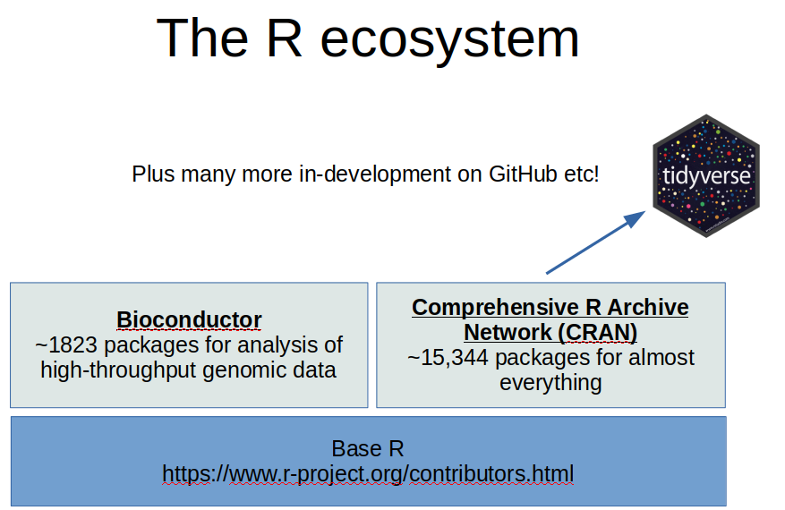
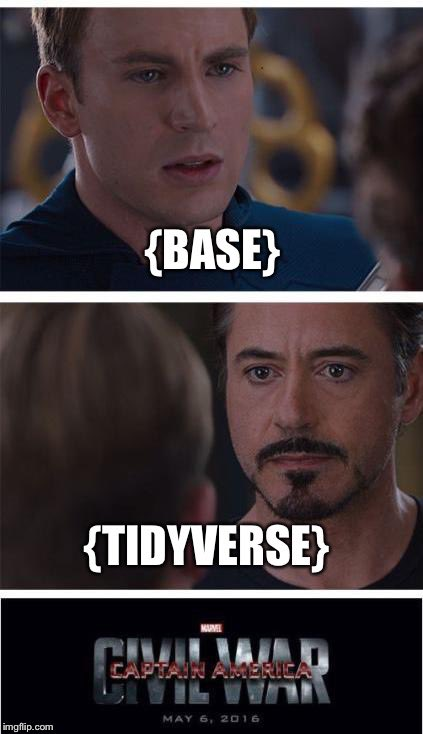
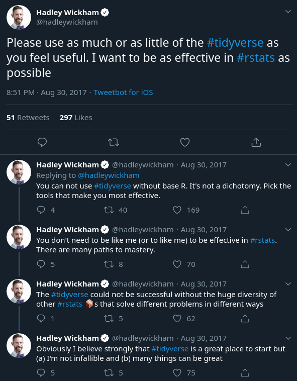
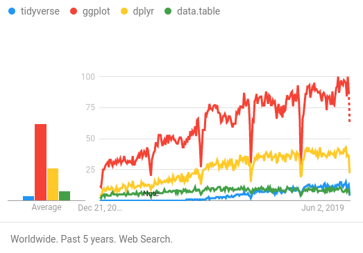

### What is Tidyverse



<https://www.tidyverse.org>

***

### tidyverse in the R ecosystem



***

### Where does Tidyverse come from?


#### Packages are developed and maintained by [RStudio Inc.](https://rstudio.com/) 
* Also make RStudio, Rstudio Server, Shiny, and a variety of other tools.
* Open source with commercial products available. 

#### Many publications including:
* Wickham, Hadley. "Tidy data." Journal of Statistical Software 59.10 (2014): 1-23.
* Wickham, Hadley. "An introduction to ggplot: an implementation of the grammar of graphics in R." Statistics (2006).
* Wickham, Hadley. "ggplot2." Wiley Interdisciplinary Reviews: Computational Statistics 3.2 (2011): 180-185. 
* Wickham, Hadley. "Reshaping data with the reshape package." Journal of statistical software 21.12 (2007): 1-20.

***

### Why was tidyverse invented?

* Out of a sense of frustration with some of the R's warts including inconsistent syntax and naming schemes.
  * Read more here <http://r4stats.com/articles/why-r-is-hard-to-learn/> 

* In order to make some steps of analysis easier, especially data manipulation

>“There are definitely some academic statisticians who just don’t understand why what I do is statistics, but basically I think they are all wrong . What I do is fundamentally statistics. The fact that data science exists as a field is a colossal failure of statistics. To me, that is what statistics is all about. It is gaining insight from data using modelling and visualization. Data munging and manipulation is hard and statistics has just said that’s not our domain.”
> [--Hadley Wickham](https://priceonomics.com/hadley-wickham-the-man-who-revolutionized-r/)

* To provide a unified approach for doing Data Science 
  * [Read the manifesto here](https://tidyverse.tidyverse.org/articles/manifesto.html)

***

### Tidyverse controversy

The growing popularity of the tidyverse has led to some controversy, and some great memes!

{width=400px}
<https://twitter.com/_ColinFay/status/901167200496750592/photo/1>

TODO ADD MORE

***

#### Some of these concerns have been outlined in the [TidyverseSkeptic document](https://github.com/matloff/TidyverseSkeptic), these include:

* Tidyverse makes learning harder, due to adding much complexity leading to **cognitive overload**
  * tidyverse tends to be verbose
*
* There is evidence that people who only learn tidyverse see base R as outdated or obsolete, this 
RStudio provides frequent [training sessions and webinars](https://resources.rstudio.com/webinars), many first time R users learn tidyverse first 


<https://www.r-bloggers.com/why-i-dont-use-the-tidyverse/>

<https://github.com/matloff/TidyverseSkeptic>

<https://www.r-bloggers.com/the-tidyverse-curse/>

<http://varianceexplained.org/r/teach-tidyverse/>

<https://ds4ps.org/2019/04/20/datatable-vs-dplyr.html>

*** 


{width=500}

https://twitter.com/hadleywickham/status/903102871163604994?lang=en

***

### Alternatives:

* Base R
* {width=75px}[data.table](https://github.com/Rdatatable/data.table/wiki) is a fast alternative with its own special syntax.
  * a tidyverse package, [dtplyr](https://github.com/tidyverse/dtplyr) is in development to prodvide access to it while maintaining tidyverse syntax.
  * A comparison of common operations in data.table and dplyr [can be found here.](https://atrebas.github.io/post/2019-03-03-datatable-dplyr/)
* {width=200px}[Python pandas](https://pandas.pydata.org/) 


***
### Should you learn tidyverse?

# Yes

1) Data science and tidyverse are intertwined and growing rapidly.

{width=500}

2) "Future proof" yourself - if the next generation of R users are mostly tidyverse users, knowing tidyverse should be a safe bet for the next ~5+ years (probably?).

3) Future jobs / resume building.

4) Code examples, availability of help.

5) Because it makes the memes **MUCH** more enjoyable!

***

### Getting setup

In the R console run the following commands to ensure that you have packages installed:


```r
if (!any(rownames(installed.packages()) == "knitr")){
  install.packages("knitr")
}
library(knitr)

if (!any(rownames(installed.packages()) == "tidyverse")){
  install.packages("tidyverse")
}
library(tidyverse)
```

***

### Download the template Markdown workshop document and open it

In the R console run the following command

```r
download.file("https://raw.githubusercontent.com/ucdavis-bioinformatics-training/2019-Winter-Bioinformatics_Command_Line_and_R_Prerequisites_Workshop/master/Intro_to_R/Intro2R/Intro_to_tidyverse_and_ggplot2.Rmd", "Intro_to_tidyverse_and_ggplot2.Rmd")
```

