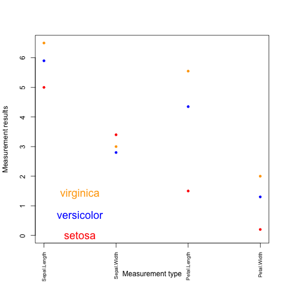

---
output:
    html_document
---

```{css echo=FALSE}
.colsel {
background-color: lightyellow;
}

pre, code {
  white-space:pre !important;
  overflow-x:scroll auto
}
```


```{r echo=FALSE}
library(knitr)
colFmt = function(x,color){
  outputFormat = opts_knit$get("rmarkdown.pandoc.to")
  if(outputFormat == 'latex')
    paste("\\textcolor{",color,"}{",x,"}",sep="")
  else if(outputFormat == 'html')
    paste("<font color='",color,"'>",x,"</font>",sep="")
  else
    x
}
```

```{r setup, include=FALSE}
knitr::opts_chunk$set(class.source = "colsel", echo=TRUE)
```


---

Topics covered in this introduction to R
====================================================
1. Basic data types in R
2. Basic data structures in R
3. Import and export data in R
4. Functions in R
5. Basic statistics in R
6. Simple data visulization in R
7. Install packages in R
8. Save data in R session
9. R markdown and R notebooks

---

Topic 1. Basic data types in R
====================================================

### There are 5 basic atomic classes: numeric (integer, complex), character, logical

Examples of numeric values.
```{r}
# assign number 150 to variable a.
a <- 150
a
# assign a number in scientific format to variable b.
b <- 3e-2
b
```

Examples of character values.
```{r}
# assign a string "BRCA1" to variable gene
gene <- "BRCA1"
gene
# assign a string "Hello World" to variable hello
hello <- "Hello World"
hello
```

Examples of logical values.
```{r}
# assign logical value "TRUE" to variable brca1_expressed
brca1_expressed <- TRUE
brca1_expressed
# assign logical value "FALSE" to variable her2_expressed
her2_expressed <- FALSE
her2_expressed
# assign logical value to a variable by logical operation
her2_expression_level <- 0
her2_expressed <- her2_expression_level > 0
her2_expressed
```

To find out the type of variable.
```{r}
class(her2_expressed)
# To check whether the variable is a specific type
is.numeric(gene)
is.numeric(a)
is.character(gene)

```

In the case that one compares two different classes of data, the coersion rule in R is `r colFmt("logical -> integer -> numeric -> complex -> character", 'red')` . The following is an example of converting a numeric variable to character.


```{r}
b
as.character(b)
```

What happens when one converts a logical variable to numeric?

```{r}
as.numeric(her2_expressed)

her2_expressed + 1

```

A logical *TRUE* is converted to integer 1 and a logical *FALSE* is converted to integer 0.


---


Topic 2. Basic data structures in R
====================================================

```{r echo=FALSE}

kable(data.frame(Homogeneous=c("Atomic vector", "Matrix", "Array"), Heterogeneous=c("List", "Data frame", ""), row.names=c("1d", "2d", "Nd"), stringsAsFactors=F), align='c') %>% kable_styling(bootstrap_options="striped", full_width=F, position="left")
```


### Atomic vectors: an atomic vector is a combination of multiple values(numeric, character or logical) in the same object. An atomic vector is created using the function c() (for concatenate).

```{r}
gene_names <- c("ESR1", "p53", "PI3K", "BRCA1", "EGFR")
gene_names

gene_expression <- c(0, 100, 50, 200, 80)
gene_expression
```

One can give names to the elements of an atomic vector.
```{r}
# assign names to a vector by specifying them
names(gene_expression) <- c("ESR1", "p53", "PI3K", "BRCA1", "EGFR")
gene_expression

# assign names to a vector using another vector
names(gene_expression) <- gene_names
gene_expression
```

Or One may create a vector with named elements from scratch.
```{r}
gene_expression <- c(ESR1=0, p53=100, PI3K=50, BRCA1=200, EGFR=80)
gene_expression
```

To find out the length of a vector:
```{r}
length(gene_expression)
```

   
##### `r colFmt("NOTE: a vector can only hold elements of the same type. If there are a mixture of data types, they will be coerced according the coersion rule mentioned earlier in this documentation.", 'red')`  


### Factors: a factor represents categorical variables, which are important in statistical modeling and can only take on a limited number of pre-defined values. The function factor() can be used to create a factor variable.

```{r}
disease_stage <- factor(c("Stage1", "Stage2", "Stage2", "Stage3", "Stage1", "Stage4"))
disease_stage
```

In R, categories are called factor levels. The function levels() can be used to access the factor levels.

```{r}
levels(disease_stage)
```

A function to compactly display the internal structure of an R object is str(). Please use str() to display the internal structure of the object we just created *disease_stage*. It shows that _disease_stage_ is a factor with four levels: "Stage1", "Stage2", "Stage3", etc... The integer numbers after the colon shows that these leves are encoded under the hood by integer numbers: the first level is 1, the second level is 2, and so on. Basically, when _factor_ function is called, R first scan through the vector to determine how many different categories there are, then it converts the character vector to a vector of integer values, with each integer value associated with a category.


```{r}
str(disease_stage)
```


By default, R infers the factor levels by ordering the unique elements in a factor alphabetically. One may specifically define the factor levels at the creation of the factor.


```{r}
disease_stage <- factor(c("Stage1", "Stage2", "Stage2", "Stage3", "Stage1", "Stage4"), levels=c("Stage2", "Stage1", "Stage3", "Stage4"))
# The encoding for levels are different from above.
str(disease_stage)
```

If you want to know the number of individuals at each levels, there are two functions: _summary_ and _table_.

```{r}
summary(disease_stage)
```

```{r}
table(disease_stage)
```

`r colFmt("Try to add a new element to a factor. This element does not match any of the levels of the factor. What will happen?", 'blue')`


### Matrices: A matrix is like an Excel sheet containing multiple rows and columns. It is used to combine vectors of the same type.

```{r}
col1 <- c(1,3,8,9)
col2 <- c(2,18,27,10)
col3 <- c(8,37,267,19)

my_matrix <- cbind(col1, col2, col3)
my_matrix

```

One other way to create a matrix is to use *matrix()* function.

```{r}
nums <- c(col1, col2, col3)
nums
matrix(nums, ncol=2)
```

```{r}
rownames(my_matrix) <- c("row1", "row2", "row3", "row4")
my_matrix

t(my_matrix)
```

To find out the dimension of a matrix:
```{r}
ncol(my_matrix)
nrow(my_matrix)
dim(my_matrix)
```


Calculations with numeric matrices.

```{r}
my_matrix * 3
log10(my_matrix)
```

Total of each row.
```{r}
rowSums(my_matrix)
```

Total of each column.
```{r}
colSums(my_matrix)
```

There is a data structure _Array_ in R, that holds multi-dimensional (d > 2) data and is a generalized version of a matrix. *Matrix* is used much more commonly than *Array*, therefore we are not going to talk about *Array* here.


### Data frames: a data frame is like a matrix but can have columns with different types (numeric, character, logical).

A data frame can be created using the function data.frame().

```{r}
# creating a data frame using pre-defined vectors
patients_name=c("Patient1", "Patient2", "Patient3", "Patient4", "Patient5", "Patient6")
Family_history=c("Y", "N", "Y", "N", "Y", "Y")
patients_age=c(31, 40, 39, 50, 45, 65)
meta.data <- data.frame(patients_name=patients_name, disease_stage=disease_stage, Family_history=Family_history, patients_age=patients_age)
meta.data
```

To check whether a data is a data frame, use the function is.data.frame().

```{r}
is.data.frame(meta.data)
```

```{r}
is.data.frame(my_matrix)
```

One can convert a matrix object to a data frame using the function as.data.frame().

```{r}
class(my_matrix)
```

```{r}
my_data <- as.data.frame(my_matrix)
class(my_data)
```

A data frame can be transposed in the similar way as a matrix.

```{r}
my_data
```

```{r}
t(my_data)
```

A data frame can be extended.

```{r}
# add a column that has the information on harmful mutations in BRCA1/BRCA2 genes for each patient.
meta.data
meta.data$BRCA <- c("YES", "NO", "YES", "YES", "YES", "NO")
meta.data
```

A data frame can also be extended using the functions cbind() and rbind(), for adding columns and rows respectively. When using cbind(), the number of values in the new column must match the number of rows in the data frame. When using rbind(), the two data frames must have the same variables/columns.

```{r}
# add a column that has the information on the racial information for each patient.
cbind(meta.data, Race=c("AJ", "AS", "AA", "NE", "NE", "AS"))
# rbind can be used to add more rows to a data frame.
rbind(meta.data, data.frame(patients_name="Patient7", disease_stage="S4", Family_history="Y", patients_age=48, BRCA="YES"))
```

One may use the function *merge* to merge two data frames horizontally, based on one or more common key variables.

```{r}
expression.data <- data.frame(patients_name=c("Patient3", "Patient4", "Patient5", "Patient1", "Patient2", "Patient6"), EGFR=c(10, 472, 103784, 1782, 187, 18289), TP53=c(16493, 72, 8193, 1849, 173894, 1482))
expression.data
merge(meta.data, expression.data, by="patients_name")
```

`r colFmt("In the previous example, we created *expression.data* with the same number of patients as *meta.data*. What if *expression.data* has less number of patients? As an exercise to understand how *merge* works, you can reduce the dimention of *expression.data* and check the *merge* results.", 'blue')`


### Lists: a list is an ordered collection of objects, which can be any type of R objects (vectors, matrices, data frames, even lists).

A list is constructed using the function list().

```{r}
my_list <- list(1:5, "a", c(TRUE, FALSE, FALSE), c(3.2, 103.0, 82.3))
my_list
str(my_list)
```

One could construct a list by giving names to elements.

```{r}
my_list <- list(Ranking=1:5, ID="a", Test=c(TRUE, FALSE, FALSE), Score=c(3.2, 103.0, 82.3))

# display the names of elements in the list using the function *names*, or *str*. Compare the output of *str* with the above results to see the difference.
names(my_list)
str(my_list)
```

```{r}
# number of elements in the list
length(my_list)
```

### Subsetting data

#### Subsetting allows one to access the piece of data of interest. When combinded with assignment, subsetting can modify selected pieces of data. The operators that can be used to subset data are: [, $, and [[.

##### First, we are going to talk about subsetting data using [, which is the most commonly used operator. We will start by looking at vectors and talk about four ways to subset a vector.

* `r colFmt("**Positive integers** return elements at the specified positions", 'purple')`

```{r}
# first to recall what are stored in gene_names
gene_names
# obtain the first and the third elements
gene_names[c(1,3)]
```

R uses 1 based indexing, meaning the first element is at the position 1, not at position 0.

* `r colFmt("**Negative integers** omit elements at the specified positions", 'purple')`

```{r}
gene_names[-c(1,3)]
```

One may not mixed positive and negative integers in one single subset operation.

```{r error=TRUE}
# The following command will produce an error.
gene_names[c(-1, 2)]
```

* `r colFmt("**Logical vectors** select elements where the corresponding logical value is TRUE", 'purple')`, This is very useful because one may write the expression that creates the logical vector.

```{r}
gene_names[c(TRUE, FALSE, TRUE, FALSE, FALSE)]
```

Recall that we have created one vector called *gene_expression*. Let's assume that *gene_expression* stores the expression values correspond to the genes in *gene_names*. Then we may subset the genes based on expression values.

```{r}
gene_expression

gene_names[gene_expression > 50]
```

If the logical vector is shorter in length than the data vector that we want to subset, then it will be recycled to be the same length as the data vector.

```{r}
gene_names[c(TRUE, FALSE)]
```

If the logical vector has "NA" in it, the corresponding value will be "NA" in the output. "NA" in R is a sysmbol for missing value.

```{r}
gene_names[c(TRUE, NA, FALSE, TRUE, NA)]
```

* `r colFmt("**Nothing** returns the original vector", 'purple')`, This is more useful for matrices, data frames than for vectors.

```{r}
gene_names[]
```

* `r colFmt("**Character vectors** return elements with matching names, when the vector is named.", 'purple')`

```{r}
gene_expression
gene_expression[c("ESR1", "p53")]
```

##### Subsetting a list works in the same way as subsetting an atomic vector. Using [ will always return a list.

```{r}
my_list[1]
```

##### Subsetting a matrix can be done by simply generalizing the one dimension subsetting: one may supply a one dimension index for each dimension of the matrix. `r colFmt("Blank/Nothing subsetting is now useful in keeping all rows or all columns.", 'red')`


```{r}
my_matrix[c(TRUE, FALSE), ]
```

##### Subsetting a data frame can be done similarly as subsetting a matrix. In addition, one may supply only one 1-dimensional index to subset a data frame. In this case, R will treat the data frame as a list with each column is an element in the list.

```{r}
# recall a data frame created from above: *meta.data*
meta.data
# subset the data frame similarly to a matrix
meta.data[c(TRUE, FALSE, FALSE, TRUE),]

# subset the data frame using one vector
meta.data[c("patients_age", "disease_stage")]
```

<br>

#### Subsetting operators: **[[** and **$**

##### **[[** is similar to **[**, except that it returns the content of the element.

```{r}
# recall my_list
my_list
# comparing [[ with [ in subsetting a list
my_list[[1]]
my_list[1]
```

`r colFmt("[[ is very useful when working with a list. Because when [ is applied to a list, it always returns a list. While [[ returns the contents of the list. [[ can only extrac/return one element, so it only accept one integer/string as input.", 'red')`

Because data frames are implemented as lists of columns, one may use [[ to extract a column from data frames.

```{r}
meta.data[["disease_stage"]]
```


<br>

##### **$** is a shorthand for **[[** combined with character subsetting.

```{r}
# subsetting a list using $ 
my_list$Score
# subsetting a data frame using
meta.data$disease_stage
```

<br>

##### Simplifying vs. preserving subsetting

We have seen some examples of simplying vs. preserving subsetting, for example:

```{r}
# simplifying subsetting
my_list[[1]]
# preserving subsetting
my_list[1]
```

Basically, simplying subsetting returns the simplest possible data structure that can represent the output. While preserving subsetting keeps the structure of the output as the same as the input. In the above example, [[ simplifies the output to a vector, while [ keeps the output as a list.

Because the syntax of carrying out simplifying and preserving subsetting differs depending on the data structure, the table below provides the information for the most basic data structure.

```{r, echo=FALSE}
kable(data.frame(Simplifying=c("x[[1]]", "x[[1]]", "x[1:3, drop=T]", "x[, 1] or x[[1]]"), Preserving=c("x[1]", "x[1]", "x[1:3]", "x[, 1, drop=F] or x[1]"), row.names=c("Vector", "List", "Factor", "Data frame"), stringsAsFactors=F), align='c') %>% kable_styling(bootstrap_options="striped", full_width=F, position="left")
```

`r colFmt("Please play around with the data structures that we have created to understand the behaviours of simplifying and preserving subsetting", 'blue')`


---

Topic 3. Import and export data in R
====================================================

R base function read.table() is a general funciton that can be used to read a file in table format. The data will be imported as a data frame.

```{r eval=FALSE}
# There is a very convenient way to read files from the internet.
data <- read.table(file="https://raw.githubusercontent.com/ucdavis-bioinformatics-training/2017-August-Variant-Analysis-Workshop/master/friday/Intro2R/raw_counts.txt", sep="\t", header=T, stringsAsFactors=F)

# To read a local file. If you have downloaded the raw_counts.txt file to your local machine, you may use the following command to read it in, by providing the full path for the file location. The way to specify the full path is the same as taught in the command line session.
download.file("https://raw.githubusercontent.com/ucdavis-bioinformatics-training/2017-August-Variant-Analysis-Workshop/master/friday/Intro2R/raw_counts.txt", "./raw_counts.txt")
data <- read.table(file="./raw_counts.txt", sep="\t", header=T, stringsAsFactors=F)

```

To check what type of object *data* is in and take a look at the beginning part of the data.
```{r}
is.data.frame(data)
head(data)
```


Depending on the format of the file, several variants of read.table() are available to make reading a file easier.

read.csv(): for reading "comma separated value" files (.csv).

read.csv2(): variant used in countries that use a comma "," as decimal point and a semicolon ";" as field separators.

read.delim(): for reading "tab separated value" files (".txt"). By default, point(".") is used as decimal point.

read.delim2(): for reading "tab separated value" files (".txt"). By default, comma (",") is used as decimal point.

```{r}
# We are going to read a file over the internet by providing the url of the file.
data2 <- read.csv(file="https://raw.githubusercontent.com/ucdavis-bioinformatics-training/2017-August-Variant-Analysis-Workshop/master/friday/Intro2R/raw_counts.csv", stringsAsFactors=F)

# To look at the file:
head(data2)
```


R base function write.table() can be used to export data to a file.

```{r}
# To write to a file called "output.txt" in your current working directory.
write.table(data2[1:20,], file="output.txt", sep="\t", quote=F, row.names=T, col.names=T)
```

It is also possible to export data to a csv file.

write.csv()

write.csv2()


---

Topic 4. Functions in R
====================================================
### Invoking a function by its name, followed by the parenthesis and zero or more arguments.

```{r}
# to find out the current working directory
getwd()

# to set a different working directory, use setwd
#setwd("/Users/jli/Desktop")

# to list all objects in the environment
ls()

# to create a vector from 2 to 3, using increment of 0.1
seq(2, 3, by=0.1)

# to create a vector with repeated elements
rep(1:3, times=3)
rep(1:3, each=3)

# to get help information on a function in R: ?function.name
?seq
?sort
?rep

```  

#### `r colFmt("One useful function to find out information on an R object: str(). It compactly display the internal structure of an R object.", 'red')`  


```{r}
str(data2)
```


### Conditional structure

Decision making is important in programming. This can be achieved using **if...else** statement.

The basic structure of a *if...else* statement is 

**if (condition statement){**

	**some operation**

**}**


Two examples of *if...else* statement

```{r}

Temperature <- 30

if (Temperature < 32){
  print("Very cold")
}

```

```{r}
# recall gene_expression, we are going to design a *if...else* statement to decide treatment plans based on gene expression.

if (gene_expression["ESR1"] > 0){
  print("Treatment plan 1")
}else if(gene_expression["BRCA1"] > 0){
  print("Treatment plan 2")
}else if(gene_expression["p53"] > 0){
  print("Treatment plan 3")
}else{
  print("Treatment plan 4")
}

```


### Loop structure

In programming, it is common that one has to do one set of specific operation on a sequence of elements. In this case, *for* loop is very useful to achieve the goal.

The basic structure of *for* loop is:

**for (value in sequence){**

  **some operation**

**}**


For excample, we would like to calculate the sum of a row for every row in the matrix we created earlier. We are going to use *for* loop to do it.


```{r}
for (i in 1:dim(my_matrix)[1]){
  out <- sum(my_matrix[i, ])
  print(out)
}
```

There is **while** loop in R similarly as in command line or any other programming language. The basic structure of *while* loop is:

**while (condition){**

  **some operation**

**}**


`r colFmt("Please rewrite the calculation of the column sum using *while* loop.", 'blue')`


### A few useful functions: apply(), lapply(), sapply(), and tapply() to replace for loop

#### apply() takes array or matrix as input and output in vector, array or list.

```{r}
# recall my_matrix
my_matrix
# check the usage of apply() function
?apply()
# calculate sums for each row
apply(my_matrix, MARGIN=1, sum)
```


#### lapply() takes list, vector or data frame as input and outputs in list.


```{r}
?lapply()

# generate some random data matrix
data <- as.data.frame(matrix(rnorm(49), ncol=7), stringsAsFactors=F)
dim(data)

# calculate the sum for each row
lapply(1:dim(data)[1], function(x){sum(data[x,])})

# comparing the results to apply() results
apply(data, MARGIN=1, sum)

# calculate log10 of the sum of each row
lapply(1:dim(data)[1], function(x){log10(sum(data[x,]))})
```

#### The function sapply() works like function lapply(), but tries to simplify the output to the most elementary data structure that is possible. As a matter of fact, sapply() is a "wrapper" function for lapply(). By default, it returns a vector.

```{r}
# To check the syntax of using sapply():
?sapply()

sapply(1:dim(data)[1], function(x){log10(sum(data[x,]))})
```

#### If the "simplify" parameter is turned off, sapply() will produced exactly the same results as lapply(), in the form of a list. By default, "simplify" is turned on.
```{r}
sapply(1:dim(data)[1], function(x){log10(sum(data[x,]))}, simplify=FALSE)
```

#### The function tapply() applys a function to each subset of a vector based on a second vector of factors.

```{r}
?tapply()

# Let's use Fisher's Iris data to demonstrate the usage of tapply().
# First, load the Iris dataset
data(iris)

# Take a look at how the data looks
head(iris)

# Generate a summary of the sepal lengths for each iris species.
tapply(iris$Sepal.Length, iris$Species, summary)
```

#### Write one's own functions

Even though there are a lot of R packages available, there are always situations where one might have to write one's own function to accomplish some very specific goals. Functions are defined by code with a specific format:

```{r}
function.name <- function(arg1=arg1, arg2, ...){
	var <- sin(arg1) + sin(arg2)  # carry out tasks
	var / 2
}
```

Here, we are going to write a function to calculate the area of a triangle given the lengths of three sides.

```{r}
my.area <- function(side1=side1, side2=side2, side3=side3){
	circonference <- (side1 + side2 + side3) / 2
	area <- sqrt(circonference * (circonference - side1) * (circonference - side2) * (circonference - side3))
	return(area)
}

# let's carry out some test
my.area(side1=3, side2=4, side3=5)
```


---

Topic 5. Basic statistics in R
====================================================

```{r echo=FALSE, results= 'asis'}
library(knitr)
kable(data.frame(Description=c("Mean", "Standard deviation", "Variance", "Minimum", "Maximum", "Median", "Range of values: minimum and maximum", "Sample quantiles", "Generic function", "Interquartile range"), R_function=c("mean()", "sd()", "var()", "min()", "max()", "median()", "range()", "quantile()", "summary()", "IQR()"), stringsAsFactors=F), align='c') %>% kable_styling(bootstrap_options=c("striped", "hover", "responsive"), full_width=F, position="center")
```

Calculate the mean expression for each sample.

```{r}
apply(data, 2, mean)
```

Calculate the range of expression for each sample.

```{r}
apply(data, 2, range)
```

Calculate the quantiles of each samples.

```{r}
apply(data, 2, quantile)
```


---

Topic 6. Simple data visulization in R
====================================================

Scatter plot and line plot can be produced using the function plot().

```{r}
x <- c(1:50)
y <- 1 + sqrt(x)/2
plot(x,y)

plot(x,y, type="l")

# plot both the points and lines
## first plot points
plot(x,y)
lines(x,y, type="l")
## lines() can only be used to add information to a graph, while it cannot produce a graph on its own.

```


boxplot() can be used to summarize data.

```{r}
boxplot(data, xlab="Sample ID", ylab="Raw Counts")
```

```{r}
x <- rnorm(1000)
boxplot(x)
```

hist() can be used to create histograms of data.
```{r}
hist(x)

# use user defined break points
hist(x, breaks=seq(range(x)[1]-1, range(x)[2]+1, by=0.5))
```

```{r}
# clear plotting device/area
dev.off()
```


---

Topic 7. Install packages in R
====================================================

Starting from Bioconductor version 3.8, the installation of packages is recommended to use BiocManager.

```{r eval=FALSE}
if (!requireNamespace("BiocManager"))
	install.packages("BiocManager")
## install core packages
BiocManager::install()
## install specific packages
BiocManager::install(c("devtools", "tidyverse"))
```

* Bioconductor has a repository and release schedule that differ from R (Bioconductor has a ‘devel’ branch to which new packages and updates are introduced, and a stable ‘release’ branch emitted once every 6 months to which bug fixes but not new features are introduced). This mismatch causes that the version detected by install.packages() is sometimes not the most recent 'release'.

* A consequence of the distinct 'devel' branch is that install.packages() sometimes points only to the 'release' repository, while users might want to have access to the leading-edge features in the develop version.

* An indirect consequence of Bioconductor's structured release is that packages generally have more extensive dependences with one another.


##### `r colFmt("It is always recommended to update to the most current version of R and Bioconductor. If it is not possible and R < 3.5.0, please use the legacy approach to install Bioconductor packages", 'red')`   

```{r eval=FALSE}
source("http://bioconductor.org/biocLite.R")
## install core packages
biocLite()
## install specific packages
biocLite(c("tidyverse", "devtools"))
```
   
The R function install.packages() can be used to install packages that are not part of Bioconductor.

```{r eval=FALSE}
install.packages("ggplot2", repos="http://cran.us.r-project.org")
```

Install from source of github.
```{r eval=FALSE}
library(devtools)
install_github("stephenturner/qqman")
```


---

Topic 8. Save data in R session
====================================================

#### To save history in R session

```{r}
savehistory(file="Dec18.history")

#loadhistory(file="Dec18.history")
```

#### To save objects in R session

```{r}
save(list=c("x", "data"), file="Dec18.RData")

#load("Dec18.RData")
```
---

Topic 9. R markdown and R notebooks
====================================================

Markdown is a system that allow easy incorporation of annotations/comments together with computing code. Both the raw source of markdown file and the rendered output are easy to read. R markdown allows both interactive mode with R and producing a reproducible document. An R notebook is an R markdown document with code chunks that can be executed independently and interactively, with output visible immediately beneath the input. In RStudio, by default, all R markdown documents are run in R notebook mode. Under the R notebook mode, when executing a chunk, the code is sent to the console to be run one line at a time. This allows execution to stop if a line raises an error.

<br>

In RStudio, creating an R notebook can be done by going to the menu command ** File -> New File -> R Notebook **.

An example of an R notebook looks like:


The way to run the R code inside the code chunk is to use the green arrow located at the top right corner of each of the code chunk, or use ** Ctrl + Shift + Enter ** on Windows, or ** Cmd + Shift + Enter ** on Mac to run the current code chunk. To run each individual code line, one uses ** Ctrl + Enter ** on Windows, or ** Cmd + Enter ** on Mac.

To render R notebook to html/pdf/word documents can be done using the **Preview** menu.


<br>

---

`r colFmt("Challenge", 'blue')`
====================================================

Working with an R notebook, load the Iris data as we did earlier in this documentation, generate a table that lists the median of each measurement (Sepal.Length, Sepal.Width, Petal.Length, Petal.Width) for each species. Then generate a plot based on the result. Finally produce an html report with the table and the plot, such as following.


```{r echo=FALSE, message=FALSE, warning=FALSE, error=FALSE}
tmp <- sapply(1:4, function(x){tapply(iris[,x], iris[[5]], median)})
colnames(tmp) <- colnames(iris)[1:4]
nms <- colnames(tmp)
kable(data.frame(tmp, stringsAsFactors=F), align='c') %>% kable_styling(bootstrap_options=c("striped", "hover", "responsive"), full_width=F, position="center")
species <- as.vector(levels(iris$Species))
x <- c(1, 2, 3, 4)
png("test.png")
plot(x, tmp["setosa",], pch=20, col='red', ylim=c(0, max(tmp)), xaxt="n", xlab="Measurement type", ylab="Measurement results", cex.lab=1.0)
points(x, tmp["virginica",], pch=20, col='orange')
points(x, tmp["versicolor",], pch=20, col='blue')
axis(1, at=x, labels=nms, las=2, cex.axis=0.7)
text(c(1.5,1.5,1.5), c(0, 0.7, 1.4), labels=species, col=c("red", "blue", "orange"), cex=1.5)
tt <- dev.off()
```




`r colFmt("Hint: in order to output a nice looking table in the final report, one may check out the documentation at https://cran.r-project.org/web/packages/htmlTable/vignettes/tables.html", 'red')`

<br>


