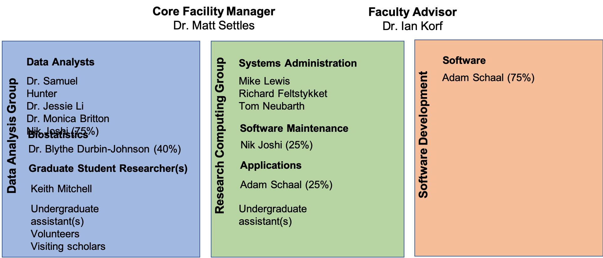

# Quick Introduction to the Workshop and Core

__The mission of the Bioinformatics Core facility is to facilitate outstanding omics-scale research through these activities:__

 

## Staff

 

## Contacts

* Bioinformatics related questions, include but not limited to bioinformatic methods questions, software use, data questions.
  * Bioinformatics.core@ucdavis.edu
* Computing Issues, include but not limited to user account questions, equipment failure/malfunction, software install, software failures (not related to use)
  * helpdesk@genomecenter.ucdavis.edu
* Training courses information
  * training.bioinformatics@ucdavis.edu

## Workshop Goals

To cover the **"prerequisites for doing bioinformatics"**

* Access to a multi-core (24 cpu or greater), ‘high’ memory 64Gb or greater Linux server.
* Familiarity with the ’command line’ and constructing scripts/pipelines.
* Basic knowledge of how to install software
* Basic knowledge of R (or equivalent) and statistical programming
* Basic knowledge of Statistics and model building

* Goal is 30-40% lecture/discussion 60-70% hands-on

## Internet

You will need to access the UCD wireless via your laptop to participate in the hands-on exercises.

### Eduroam

Many academic institutions are part of Eduroam. (See "List of Institutions" under
"Members" at https://www.eduroam.us/ to find out if your institution is a member.) Please make sure you
can log into Eduroam with your device at your home institution, which will make things easier once you come to UCD.

### UCD Guest wireless

You will need to access the UCD wireless via your laptop to participate in the hands-on exercises. Please review [http://itcatalog.ucdavis.edu/service/wireless-guest-access](http://itcatalog.ucdavis.edu/service/wireless-guest-access) for access instructions.

## Workshop Materials

Workshop materials are all posted on github, and publicly available

http://bioinformatics.ucdavis.edu/training/events/

* Github main page:

	https://github.com/ucdavis-bioinformatics-training

* This RNAseq Workshop

  https://ucdavis-bioinformatics-training.github.io/2019-Winter-Bioinformatics_Command_Line_and_R_Prerequisites_Workshop/  

  https://github.com/ucdavis-bioinformatics-training/2019-Winter-Bioinformatics_Command_Line_and_R_Prerequisites_Workshop

## Computing Cluster

Course will be conducted on our servers and compute cluster .  
tadpole.genomecenter.ucdavis.edu

Everyone should get an account.  
https://computing.genomecenter.ucdavis.edu	 

Request an account -> sponsor "Bioinformatics Core Workshop"

If you already have an account on our systems, then please tell us your username.

Cluster usage will be under the slurm reservation  ‘workshop’

Reservation will last 1 full week after the workshop and allow you to practice or run analyze your own data.

**workshop       ACTIVE  2019-08-19T00:00:00  2019-08-31T00:00:00  12-00:00:00  rafter-[0,2,8,14,18]**
